ARIMA in R Programming
================
Deepaneesh R V
2025-02-25

# Packages

I am using several packages in R for time series analysis.

``` r
library(forecast)
library(tseries)
library(ggplot2)
library(dplyr)
library(tidyverse)
```

# ARIMA

ARIMA (AutoRegressive Integrated Moving Average) is a popular time
series forecasting model that combines three key components:

1.  **AR (AutoRegressive - p):**

- Uses past values (lags) of the time series to predict future values.
- Example: If p=2, the model uses the last two values to predict the
  next one.

2.  **I (Integrated - d):**

- Uses differencing of the time series to make it stationary.
- Example: If d=1, the model uses the difference between the current
  value and the previous one to predict the next one.

3.  **MA (Moving Average - q):**

- Uses the residual errors from past predictions to predict future
  values.
- Example: If q=2, the model uses the last two residual errors to
  predict the next one.

# Data

We will use the AirPassengers dataset from the forecast package created
by Rob J. Hyndman. This dataset contains the number of international
airline passengers from 1949 to 1960. The data is recorded monthly and
has a frequency of 12.

``` r
library(forecast)
library(tseries)
timedata= ts(AirPassengers, frequency = 12,start = c(1949,1))
```

## Ploting the data

``` r
library(ggplot2)
autoplot(timedata)+
  labs(title="Airpassangers")+
  theme(plot.title = element_text(hjust=0.5,face="bold"))
```

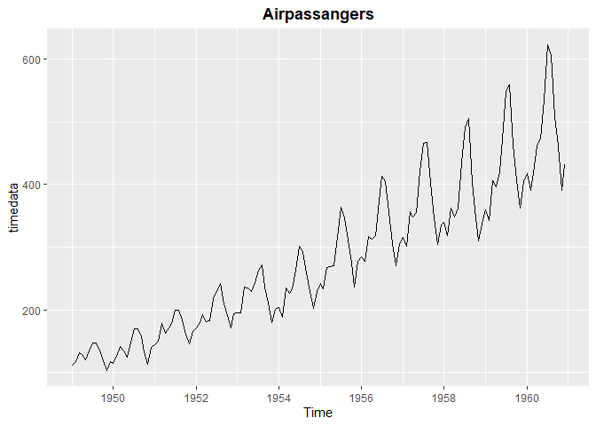<!-- -->

The plot indicates an increasing trend with seasonality present.
Therefore, we will use the Augmented Dickey-Fuller test to check for
stationarity.

## Checking for Stationarity

Null Hypothesis(H0): The data is non-stationary

Alternate Hypothesis(H1): The data is stationary

``` r
# Checking for stationary 
adf.test(timedata)
```

    ## 
    ##  Augmented Dickey-Fuller Test
    ## 
    ## data:  timedata
    ## Dickey-Fuller = -7.3186, Lag order = 5, p-value = 0.01
    ## alternative hypothesis: stationary

the p value is less than 0.05, so the data is stationary.

using the decompose function to decompose the time series into trend,
seasonality, and residuals.

## Decomposing the time series

With the help of the above charts, we can easily see the trend. Seasonal
variations are increasing over time, so we can say that the data is
multiplicative in nature.

``` r
# Decomposing the time series
decompose(timedata,type = "multiplicative") %>% plot()
```

<!-- -->

Using the STL function to decompose the time series into trend,
seasonality, and residuals is within the limits or not.

## STL Decomposition

``` r
stl(timedata, s.window="periodic") %>% plot()
```

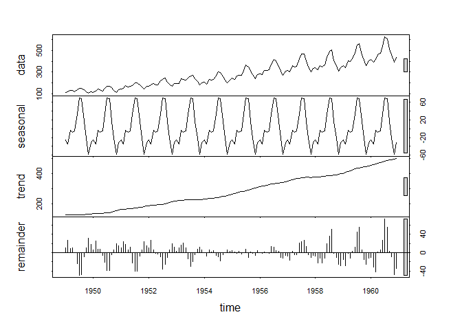<!-- -->

The error bars in the data and trend component are not within the
limits; therefore, we can conclude that the data is multiplicative in
nature and is well-fitted for multiplicative decomposition.

# Checking for Seasonal and Trend in the data

Analyzing the data for seasonality and trends using the ggseasonplot and
ggsubseriesplot functions.

## Seasonality Checking

Let’s create a line graph for each year, breaking it down by month! This
will help us see if there are any seasonal trends.

``` r
ggseasonplot(timedata)+
  labs(title="Seasonality of Airpassangers")+
  theme(plot.title = element_text(hjust=0.5,face="bold"))
```

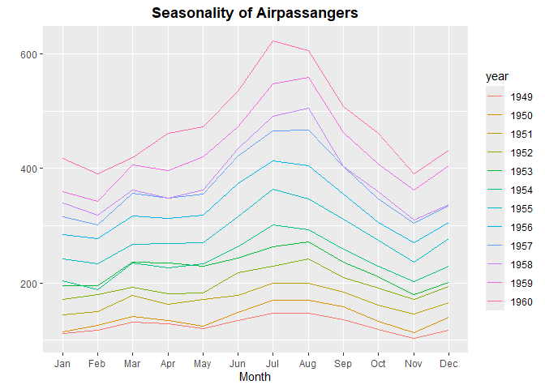<!-- -->

The plot indicates that the data exhibits seasonality, as it
consistently increases in July and decreases in November. To further
analyze this, we can use a circular or polar chart; if the circle shifts
in any direction, it suggests that there is a seasonal variation in the
data.

``` r
ggseasonplot(timedata,polar = T)+
  labs(title="Seasonality of Airpassangers")+
  theme(plot.title = element_text(hjust=0.5,face="bold"))
```

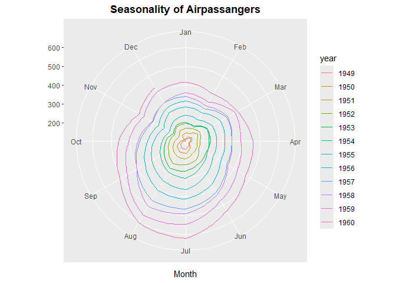<!-- -->

The chart vividly illustrates that the data showcases a distinct
seasonality, with a notable peak around July. This fascinating trend
highlights how certain patterns can emerge within the data, making July
a month of particular interest.

# Computing Arima Model

Based on the charts and analysis above, we can conclude that the data is
stationary, multiplicative in nature, and exhibits seasonality.
Therefore, we can compute the ARIMA model.

## ACF Plot

``` r
# ACF and PACF plots
ggAcf(timedata)+
  labs(title="ACF plot of Airpassangers")+
  theme(plot.title = element_text(hjust=0.5,face="bold"))
```

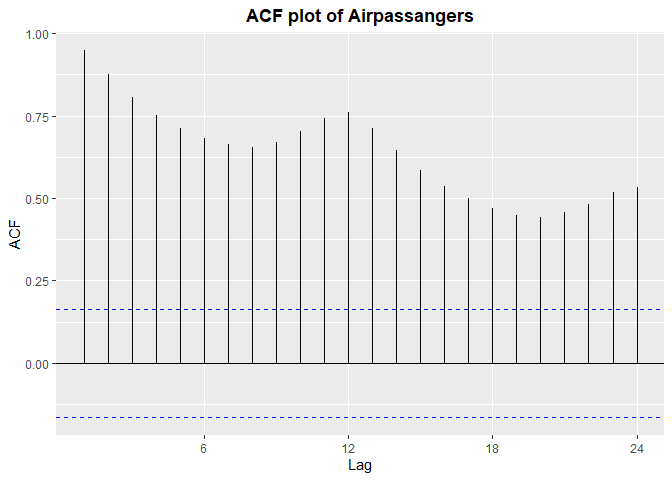<!-- -->

the above plot shows that the model is Moving Average (MA) model. (q=0)

## PACF Plot

``` r
ggPacf(timedata)+
  labs(title="PACF plot of Airpassangers")+
  theme(plot.title = element_text(hjust=0.5,face="bold"))
```

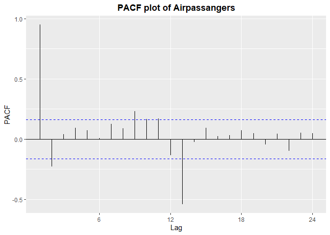<!-- -->

the above chart shows that the model have autoregressive (AR) model
(p=1)

## Auto ARIMA

using the auto arima function to compute the ARIMA model with the help
of AIC and BIC values.

``` r
#  Auto ARIMA
model =auto.arima(timedata,ic=("bic"),seasonal = T)
model
```

    ## Series: timedata 
    ## ARIMA(1,1,0)(0,1,0)[12] 
    ## 
    ## Coefficients:
    ##           ar1
    ##       -0.3076
    ## s.e.   0.0828
    ## 
    ## sigma^2 = 138.1:  log likelihood = -508.2
    ## AIC=1020.39   AICc=1020.49   BIC=1026.14

``` r
summary(model)
```

    ## Series: timedata 
    ## ARIMA(1,1,0)(0,1,0)[12] 
    ## 
    ## Coefficients:
    ##           ar1
    ##       -0.3076
    ## s.e.   0.0828
    ## 
    ## sigma^2 = 138.1:  log likelihood = -508.2
    ## AIC=1020.39   AICc=1020.49   BIC=1026.14
    ## 
    ## Training set error measures:
    ##                     ME     RMSE      MAE       MPE     MAPE     MASE
    ## Training set 0.2165044 11.16457 8.203538 0.0249196 2.930922 0.256118
    ##                      ACF1
    ## Training set -0.002758056

the auto arima choose the best model by using aic and bic values

## Forecasting

forecasting for next 24 months using the forecast function.

``` r
future=forecast(model,h=24)
future
```

    ##          Point Forecast    Lo 80    Hi 80    Lo 95    Hi 95
    ## Jan 1961       444.3076 429.2489 459.3663 421.2773 467.3379
    ## Feb 1961       418.2130 399.8970 436.5289 390.2011 446.2248
    ## Mar 1961       446.2421 424.4263 468.0579 412.8777 479.6065
    ## Apr 1961       488.2331 463.6123 512.8540 450.5788 525.8875
    ## May 1961       499.2359 472.0414 526.4304 457.6455 540.8263
    ## Jun 1961       562.2351 532.7065 591.7636 517.0750 607.3951
    ## Jul 1961       649.2353 617.5395 680.9312 600.7607 697.7099
    ## Aug 1961       633.2352 599.5124 666.9580 581.6607 684.8098
    ## Sep 1961       535.2353 499.6002 570.8703 480.7362 589.7343
    ## Oct 1961       488.2352 450.7856 525.6849 430.9610 545.5095
    ## Nov 1961       417.2353 378.0549 456.4156 357.3141 477.1564
    ## Dec 1961       459.2352 418.3975 500.0730 396.7794 521.6911
    ## Jan 1962       471.5429 422.8198 520.2660 397.0273 546.0584
    ## Feb 1962       445.4482 392.0121 498.8843 363.7248 527.1717
    ## Mar 1962       473.4773 415.1553 531.7994 384.2815 562.6732
    ## Apr 1962       515.4684 452.8010 578.1358 419.6269 611.3099
    ## May 1962       526.4711 459.6943 593.2480 424.3447 628.5976
    ## Jun 1962       589.4703 518.8361 660.1045 481.4446 697.4960
    ## Jul 1962       676.4706 602.1751 750.7660 562.8455 790.0957
    ## Aug 1962       660.4705 582.6871 738.2539 541.5110 779.4299
    ## Sep 1962       562.4705 481.3486 643.5924 438.4053 686.5357
    ## Oct 1962       515.4705 431.1423 599.7987 386.5017 644.4393
    ## Nov 1962       444.4705 357.0535 531.8875 310.7778 578.1632
    ## Dec 1962       486.4705 396.0702 576.8708 348.2152 624.7258

ploting the forecasted data using the autoplot function.

``` r
autoplot(future)+
  labs(title="Forecasting Airpassangers")+
  theme(plot.title = element_text(hjust=0.5,face="bold"))+
  labs(y = "Airpassangers")
```

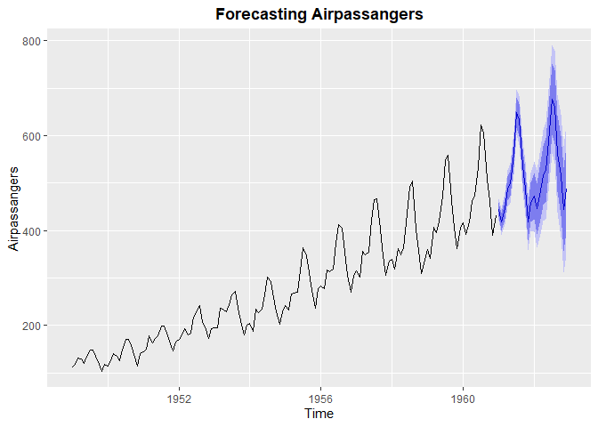<!-- -->

The forecasted data shows that the number of air passengers will
increase in the future. and follows the same pattern as the historical
data.

## Checking Residuals

``` r
checkresiduals(model)
```

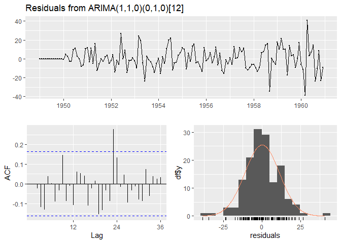<!-- -->

    ## 
    ##  Ljung-Box test
    ## 
    ## data:  Residuals from ARIMA(1,1,0)(0,1,0)[12]
    ## Q* = 41.392, df = 23, p-value = 0.01068
    ## 
    ## Model df: 1.   Total lags used: 24

Since the p-value (0.01068) is less than 0.05, we reject the null
hypothesis at the 5% significance level. This indicates that the
residuals are autocorrelated, suggesting the ARIMA(1,1,0)(0,1,0)\[12\]
model may not be an appropriate fit.

``` r
acf(model$residuals)
```

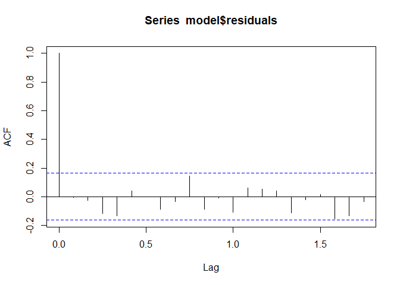<!-- -->

``` r
pacf(model$residuals)
```

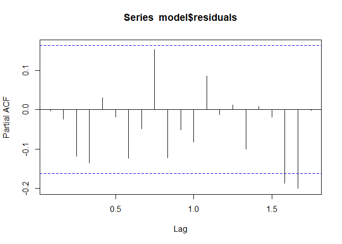<!-- -->

# Computing ARIMA manually

We know that the model has an ACF (q=0) and a PACF (p=1), so we can
compute the ARIMA model manually. However, why does the auto ARIMA
function require differencing even if the data is stationary?

## Checking for N differencing

checking for the differencing using the ndiffs function.

``` r
ndiffs(timedata)
```

    ## [1] 1

The data has been differenced once to achieve stationarity.

## Differencing the data

``` r
diff1=diff(timedata)
autoplot(diff1)+
  labs(title="Differenced Airpassangers")+
  theme(plot.title = element_text(hjust=0.5,face="bold"))
```

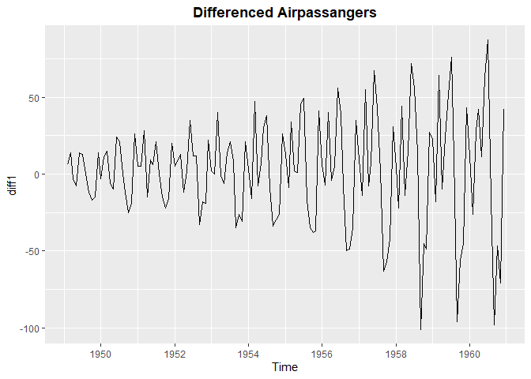<!-- -->

we successfully differenced the data and now we can compute the ARIMA
model manually.

now checking for Stationarity of the differenced data

## Checking for Stationarity

``` r
adf.test(diff1)
```

    ## 
    ##  Augmented Dickey-Fuller Test
    ## 
    ## data:  diff1
    ## Dickey-Fuller = -7.0177, Lag order = 5, p-value = 0.01
    ## alternative hypothesis: stationary

the p value is less than 0.05, so the differenced data is stationary.

## ACF plot of differenced data

``` r
ggAcf(diff1)+
  labs(title="ACF plot of Differenced Airpassangers")+
  theme(plot.title = element_text(hjust=0.5,face="bold"))
```

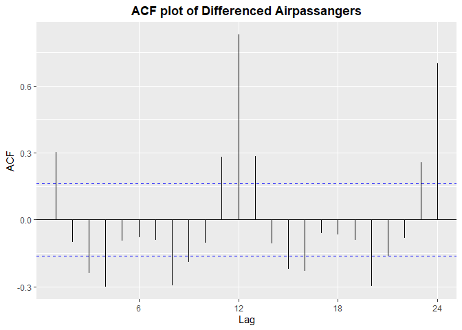<!-- -->

the above plot shows that the model is Moving Average (MA) model. (q=0)

## PACF plot of differenced data

``` r
ggPacf(diff1)+
  labs(title="PACF plot of Differenced Airpassangers")+
  theme(plot.title = element_text(hjust=0.5,face="bold"))
```

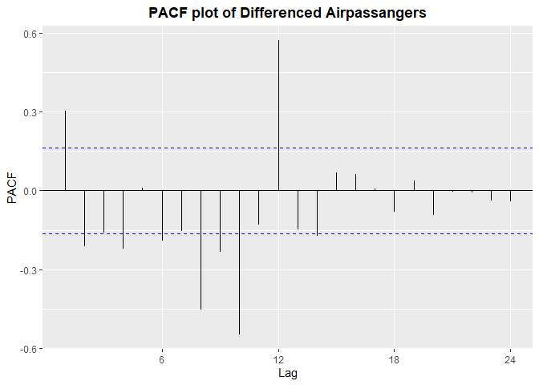<!-- -->

the above chart shows that the model have autoregressive (AR) model
(p=1)

## Computing ARIMA manually

``` r
model1=arima(timedata,order=c(1,1,0),seasonal = list(order=c(0,1,0),period=12))
model1
```

    ## 
    ## Call:
    ## arima(x = timedata, order = c(1, 1, 0), seasonal = list(order = c(0, 1, 0), 
    ##     period = 12))
    ## 
    ## Coefficients:
    ##           ar1
    ##       -0.3076
    ## s.e.   0.0828
    ## 
    ## sigma^2 estimated as 137:  log likelihood = -508.2,  aic = 1020.39

``` r
summary(model1)
```

    ## 
    ## Call:
    ## arima(x = timedata, order = c(1, 1, 0), seasonal = list(order = c(0, 1, 0), 
    ##     period = 12))
    ## 
    ## Coefficients:
    ##           ar1
    ##       -0.3076
    ## s.e.   0.0828
    ## 
    ## sigma^2 estimated as 137:  log likelihood = -508.2,  aic = 1020.39
    ## 
    ## Training set error measures:
    ##                     ME     RMSE      MAE       MPE     MAPE      MASE
    ## Training set 0.2165044 11.16457 8.203538 0.0249196 2.930922 0.3172271
    ##                      ACF1
    ## Training set -0.002758056

## Forecasting

forecasting for next 24 months using the forecast function.

``` r
future1=forecast(model1,h=24)
future1
```

    ##          Point Forecast    Lo 80    Hi 80    Lo 95    Hi 95
    ## Jan 1961       444.3076 429.3066 459.3087 421.3655 467.2497
    ## Feb 1961       418.2130 399.9672 436.4588 390.3084 446.1176
    ## Mar 1961       446.2421 424.5098 467.9744 413.0055 479.4787
    ## Apr 1961       488.2331 463.7066 512.7597 450.7230 525.7433
    ## May 1961       499.2359 472.1456 526.3262 457.8048 540.6670
    ## Jun 1961       562.2351 532.8196 591.6505 517.2479 607.2222
    ## Jul 1961       649.2353 617.6608 680.8098 600.9463 697.5243
    ## Aug 1961       633.2352 599.6416 666.8289 581.8582 684.6123
    ## Sep 1961       535.2353 499.7367 570.7338 480.9449 589.5256
    ## Oct 1961       488.2352 450.9290 525.5415 431.1803 545.2902
    ## Nov 1961       417.2353 378.2050 456.2655 357.5436 476.9269
    ## Dec 1961       459.2352 418.5539 499.9166 397.0185 521.4520
    ## Jan 1962       471.5429 423.0063 520.0794 397.3127 545.7731
    ## Feb 1962       445.4482 392.2168 498.6797 364.0377 526.8587
    ## Mar 1962       473.4773 415.3787 531.5760 384.6231 562.3316
    ## Apr 1962       515.4684 453.0410 577.8958 419.9939 610.9429
    ## May 1962       526.4711 459.9500 592.9923 424.7358 628.2065
    ## Jun 1962       589.4703 519.1066 659.8340 481.8583 697.0823
    ## Jul 1962       676.4706 602.4596 750.4815 563.2806 789.6605
    ## Aug 1962       660.4705 582.9850 737.9560 541.9666 778.9744
    ## Sep 1962       562.4705 481.6593 643.2817 438.8804 686.0606
    ## Oct 1962       515.4705 431.4653 599.4757 386.9956 643.9454
    ## Nov 1962       444.4705 357.3883 531.5527 311.2898 577.6512
    ## Dec 1962       486.4705 396.4164 576.5246 348.7446 624.1964

ploting the forecasted data using the autoplot function.

``` r
autoplot(future1)+
  labs(title="Forecasting Airpassangers")+
  theme(plot.title = element_text(hjust=0.5,face="bold"))+
  labs(y = "Airpassangers")
```

<!-- -->

By visually their is no difference between the auto arima and manual
arima model.

## Checking Residuals

``` r
checkresiduals(model1)
```

<!-- -->

    ## 
    ##  Ljung-Box test
    ## 
    ## data:  Residuals from ARIMA(1,1,0)(0,1,0)[12]
    ## Q* = 41.392, df = 23, p-value = 0.01068
    ## 
    ## Model df: 1.   Total lags used: 24

hypothesis test for the Ljung-Box test:

The Ljung-Box test p-value is 0.01, which is less than 0.05, so we
reject the null hypothesis at a 5% significance level,and conclude that
the residuals are not autocorrelated.

# Conclusion

Computing ARIMA, whether manually or automatically, yields the same
results. The data is stationary, multiplicative, and seasonal, making
the ARIMA model the best fit for it.
