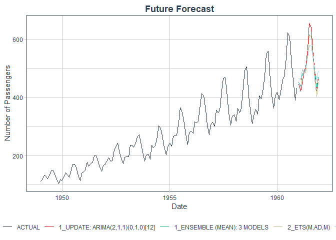
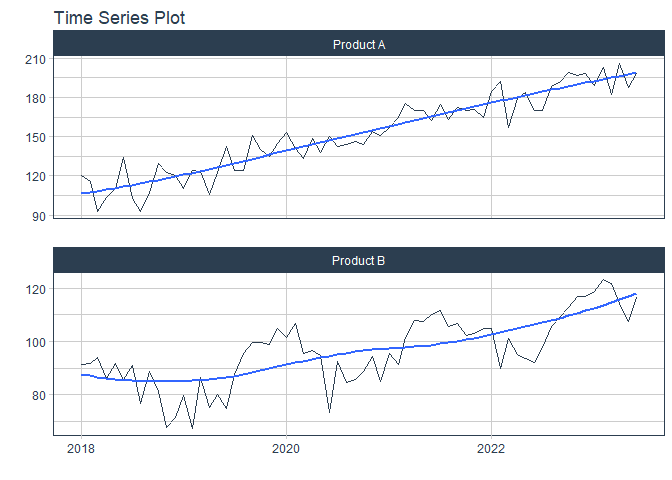

Modeltime
================

# Modeltime

Modeltime is a framework for building, evaluating, and deploying time
series models in R. It provides a consistent interface for working with
various time series models, making it easier to compare and select the
best model for your data.

# Power of modeltime

Modeltime allows you to: - Build and evaluate multiple time series
models using a consistent interface. - Compare model performance using
various metrics. - Easily deploy models for forecasting. - Integrate
with other R packages for data manipulation and visualization.

# Steps in modeltime

1.  **Data Preparation**: Prepare your time series data, ensuring it is
    in the correct format.
2.  **Model Specification**: Specify the models you want to use for
    forecasting.
3.  **Model Fitting**: Fit the models to your training data.
4.  **Model Evaluation**: Evaluate the models using various metrics to
    determine their performance.
5.  **Model Forecasting**: Use the best-performing model to make
    forecasts on new data.
6.  **Model Deployment**: Deploy the model for production use, allowing
    for real-time forecasting.

packages needed:

    library(modeltime)
    library(tidymodels)
    library(timetk)
    library(dplyr)
    library(lubridate)
    library(ggplot2)
    library(zoo)
    library(modeltime.ensemble)
    library(plotly)
    library(ggplot2)

# Example of modeltime usage

## Load necessary libraries

``` r
library(modeltime)
```

    ## Warning: package 'modeltime' was built under R version 4.4.3

``` r
library(tidymodels)
```

    ## Warning: package 'tidymodels' was built under R version 4.4.3

    ## ── Attaching packages ────────────────────────────────────── tidymodels 1.3.0 ──

    ## ✔ broom        1.0.8     ✔ recipes      1.3.1
    ## ✔ dials        1.4.0     ✔ rsample      1.3.0
    ## ✔ dplyr        1.1.4     ✔ tibble       3.2.1
    ## ✔ ggplot2      3.5.2     ✔ tidyr        1.3.1
    ## ✔ infer        1.0.9     ✔ tune         1.3.0
    ## ✔ modeldata    1.4.0     ✔ workflows    1.2.0
    ## ✔ parsnip      1.3.2     ✔ workflowsets 1.1.1
    ## ✔ purrr        1.0.4     ✔ yardstick    1.3.2

    ## Warning: package 'broom' was built under R version 4.4.3

    ## Warning: package 'dials' was built under R version 4.4.3

    ## Warning: package 'scales' was built under R version 4.4.3

    ## Warning: package 'ggplot2' was built under R version 4.4.3

    ## Warning: package 'infer' was built under R version 4.4.3

    ## Warning: package 'parsnip' was built under R version 4.4.3

    ## Warning: package 'purrr' was built under R version 4.4.3

    ## Warning: package 'recipes' was built under R version 4.4.3

    ## Warning: package 'rsample' was built under R version 4.4.3

    ## Warning: package 'tune' was built under R version 4.4.3

    ## Warning: package 'workflows' was built under R version 4.4.3

    ## Warning: package 'workflowsets' was built under R version 4.4.3

    ## Warning: package 'yardstick' was built under R version 4.4.3

    ## ── Conflicts ───────────────────────────────────────── tidymodels_conflicts() ──
    ## ✖ purrr::discard() masks scales::discard()
    ## ✖ dplyr::filter()  masks stats::filter()
    ## ✖ dplyr::lag()     masks stats::lag()
    ## ✖ recipes::step()  masks stats::step()

``` r
library(timetk)
```

    ## Warning: package 'timetk' was built under R version 4.4.3

``` r
library(dplyr)
library(lubridate)
```

    ## 
    ## Attaching package: 'lubridate'

    ## The following objects are masked from 'package:base':
    ## 
    ##     date, intersect, setdiff, union

``` r
library(ggplot2)
library(zoo)
```

    ## Warning: package 'zoo' was built under R version 4.4.3

    ## 
    ## Attaching package: 'zoo'

    ## The following objects are masked from 'package:base':
    ## 
    ##     as.Date, as.Date.numeric

``` r
library(modeltime.ensemble)
```

    ## Warning: package 'modeltime.ensemble' was built under R version 4.4.3

    ## Loading required package: modeltime.resample

    ## Warning: package 'modeltime.resample' was built under R version 4.4.3

``` r
library(plotly)
```

    ## Warning: package 'plotly' was built under R version 4.4.3

    ## 
    ## Attaching package: 'plotly'

    ## The following object is masked from 'package:ggplot2':
    ## 
    ##     last_plot

    ## The following object is masked from 'package:stats':
    ## 
    ##     filter

    ## The following object is masked from 'package:graphics':
    ## 
    ##     layout

``` r
library(ggplot2)
```

## Load example data

``` r
data <- tibble(
  date  = as.Date(as.yearmon(time(AirPassengers))),
  value = as.numeric(AirPassengers)
)
```

the data should be in a tibble format with a date column and a value
column.

## plotling the data

interactive graph

    data %>% plot_time_series(date, value,.title="Air Passengers Data", .x_lab="Date", .y_lab="Number of Passengers",.interactive = T) %>% layout(title = list(text = "Air Passengers Data", x = 0.5))

this will plot the time series data, allowing you to visualize trends
and patterns over time.

for non interactive graph

``` r
data %>% plot_time_series(date, value,.title="Air Passengers Data", .x_lab="Date", .y_lab="Number of Passengers",.interactive = F)+
  theme(plot.title = element_text(hjust = 0.5, face = "bold"))
```

<!-- -->

## Extracting the Values from date

``` r
features <- data %>%
  select(date, value) %>%
  tk_augment_timeseries_signature()
```

    ## tk_augment_timeseries_signature(): Using the following .date_var variable: date

``` r
head(features)
```

    ## # A tibble: 6 × 30
    ##   date       value  index.num    diff  year year.iso  half quarter month
    ##   <date>     <dbl>      <dbl>   <dbl> <int>    <int> <int>   <int> <int>
    ## 1 1949-01-01   112 -662688000      NA  1949     1948     1       1     1
    ## 2 1949-02-01   118 -660009600 2678400  1949     1949     1       1     2
    ## 3 1949-03-01   132 -657590400 2419200  1949     1949     1       1     3
    ## 4 1949-04-01   129 -654912000 2678400  1949     1949     1       2     4
    ## 5 1949-05-01   121 -652320000 2592000  1949     1949     1       2     5
    ## 6 1949-06-01   135 -649641600 2678400  1949     1949     1       2     6
    ## # ℹ 21 more variables: month.xts <int>, month.lbl <ord>, day <int>, hour <int>,
    ## #   minute <int>, second <int>, hour12 <int>, am.pm <int>, wday <int>,
    ## #   wday.xts <int>, wday.lbl <ord>, mday <int>, qday <int>, yday <int>,
    ## #   mweek <int>, week <int>, week.iso <int>, week2 <int>, week3 <int>,
    ## #   week4 <int>, mday7 <int>

this will extract the time series features from the date column,
creating additional columns such as year, month, day, etc. This is
useful for creating more informative features for modeling.

## Split the data into training and testing sets

``` r
splits <- initial_time_split(data, prop = 0.9)
```

## Specify the model

``` r
model_arima <- arima_reg() %>%
  set_engine("auto_arima") %>%
  fit(value ~ date, data = training(splits))
```

    ## frequency = 12 observations per 1 year

``` r
model_ets <- exp_smoothing(seasonal_period = 12) %>%
  set_engine("ets") %>%
  fit(value ~ date, data = training(splits))

model_prophet <- prophet_reg() %>%
  set_engine("prophet") %>%
  fit(value ~ date, data = training(splits))
```

    ## Disabling weekly seasonality. Run prophet with weekly.seasonality=TRUE to override this.

    ## Disabling daily seasonality. Run prophet with daily.seasonality=TRUE to override this.

## Create a modeltime table

``` r
models_tbl <- modeltime_table(
  model_arima,
  model_ets,
  model_prophet
)
```

model table is a table that contains all the models you want to compare.

## to know the summary of the models

``` r
# ARIMA Summary
models_tbl %>% 
  pluck_modeltime_model(1)
```

    ## parsnip model object
    ## 
    ## Series: outcome 
    ## ARIMA(1,1,0)(0,1,0)[12] 
    ## 
    ## Coefficients:
    ##           ar1
    ##       -0.2435
    ## s.e.   0.0898
    ## 
    ## sigma^2 = 109.3:  log likelihood = -436.39
    ## AIC=876.78   AICc=876.88   BIC=882.28

``` r
# ETS Summary
models_tbl %>% 
  pluck_modeltime_model(2)
```

    ## parsnip model object
    ## 
    ## ETS(M,Ad,M) 
    ## 
    ## Call:
    ## forecast::ets(y = outcome, model = model_ets, damped = damping_ets, 
    ##     alpha = alpha, beta = beta, gamma = gamma)
    ## 
    ##   Smoothing parameters:
    ##     alpha = 0.7699 
    ##     beta  = 0.023 
    ##     gamma = 1e-04 
    ##     phi   = 0.9798 
    ## 
    ##   Initial states:
    ##     l = 120.7418 
    ##     b = 1.7557 
    ##     s = 0.8969 0.7954 0.9171 1.0549 1.2142 1.2253
    ##            1.1076 0.9793 0.982 1.0255 0.8933 0.9084
    ## 
    ##   sigma:  0.0382
    ## 
    ##      AIC     AICc      BIC 
    ## 1213.724 1219.943 1265.201

``` r
# Prophet Model (no summary method, inspect structure)
models_tbl %>% 
  pluck_modeltime_model(3)
```

    ## parsnip model object
    ## 
    ## PROPHET Model
    ## - growth: 'linear'
    ## - n.changepoints: 25
    ## - changepoint.range: 0.8
    ## - yearly.seasonality: 'auto'
    ## - weekly.seasonality: 'auto'
    ## - daily.seasonality: 'auto'
    ## - seasonality.mode: 'additive'
    ## - changepoint.prior.scale: 0.05
    ## - seasonality.prior.scale: 10
    ## - holidays.prior.scale: 10
    ## - logistic_cap: NULL
    ## - logistic_floor: NULL
    ## - extra_regressors: 0

## Evaluate the models on the testing set

``` r
calibration_tbl <- models_tbl %>%
  modeltime_calibrate(new_data = testing(splits))
```

this will give you a table with the calibrated models.

``` r
calibration_tbl %>%
  modeltime_forecast(
    new_data = testing(splits),
    actual_data = data
  )
```

    ## # Forecast Results
    ## 

    ## Conf Method: conformal_default | Conf Interval: 0.95 | Conf By ID: FALSE
    ## (GLOBAL CONFIDENCE)

    ## # A tibble: 189 × 7
    ##    .model_id .model_desc .key   .index     .value .conf_lo .conf_hi
    ##        <int> <chr>       <fct>  <date>      <dbl>    <dbl>    <dbl>
    ##  1        NA ACTUAL      actual 1949-01-01    112       NA       NA
    ##  2        NA ACTUAL      actual 1949-02-01    118       NA       NA
    ##  3        NA ACTUAL      actual 1949-03-01    132       NA       NA
    ##  4        NA ACTUAL      actual 1949-04-01    129       NA       NA
    ##  5        NA ACTUAL      actual 1949-05-01    121       NA       NA
    ##  6        NA ACTUAL      actual 1949-06-01    135       NA       NA
    ##  7        NA ACTUAL      actual 1949-07-01    148       NA       NA
    ##  8        NA ACTUAL      actual 1949-08-01    148       NA       NA
    ##  9        NA ACTUAL      actual 1949-09-01    136       NA       NA
    ## 10        NA ACTUAL      actual 1949-10-01    119       NA       NA
    ## # ℹ 179 more rows

this will give you the forecasted values for the testing set.

## Plot the forecasted values

interactive Graph

    calibration_tbl %>%
      modeltime_forecast(
        new_data = testing(splits),
        actual_data = data
      ) %>%
      plot_modeltime_forecast(.title = "Forecasted Values vs Actuals",
                              .x_lab = "Date",
                              .y_lab = "Number of Passengers") %>%
      layout(title = list(text = "Forecasted Values vs Actuals", x = 0.5))

for non interactive graph

``` r
calibration_tbl %>%
  modeltime_forecast(
    new_data = testing(splits),
    actual_data = data
  ) %>%
  plot_modeltime_forecast(.title = "Forecasted Values vs Actuals",
                          .x_lab = "Date",
                          .y_lab = "Number of Passengers",
                          .interactive = F) +
  theme(plot.title = element_text(hjust = 0.5, face = "bold"))
```

    ## Warning in max(ids, na.rm = TRUE): no non-missing arguments to max; returning
    ## -Inf

<!-- -->

This will plot the forecasted values along with the actual values from
the testing set.

# Evolution of models by metrics

``` r
calibration_tbl %>%
  modeltime_accuracy() %>%
  arrange(rmse)
```

    ## # A tibble: 3 × 9
    ##   .model_id .model_desc             .type   mae  mape  mase smape  rmse   rsq
    ##       <int> <chr>                   <chr> <dbl> <dbl> <dbl> <dbl> <dbl> <dbl>
    ## 1         1 ARIMA(1,1,0)(0,1,0)[12] Test   14.0  3.18 0.310  3.10  18.1 0.957
    ## 2         2 ETS(M,AD,M)             Test   20.4  4.20 0.453  4.25  26.1 0.929
    ## 3         3 PROPHET                 Test   29.8  6.15 0.660  6.20  39.2 0.928

This will give you a table with the accuracy metrics for each model,
sorted by RMSE (Root Mean Square Error).

To visualize the accuracy metrics, you can use the
`table_modeltime_accuracy()` function:

    calibration_tbl %>%
      modeltime_accuracy() %>%
      table_modeltime_accuracy() 

## Refitting

``` r
# Refit for the entire dataset
refit_tbl <- calibration_tbl %>%
  modeltime_refit(data = data)
```

    ## frequency = 12 observations per 1 year

    ## Disabling weekly seasonality. Run prophet with weekly.seasonality=TRUE to override this.

    ## Disabling daily seasonality. Run prophet with daily.seasonality=TRUE to override this.

This will refit the models using the entire dataset, allowing you to use
them for forecasting on new data.

## Forecasting on new data

``` r
# Forecasting for the next 12 months
future_tbl <- data %>%
  future_frame(.date_var = date, .length_out = 12)
```

mention the future frame function which creates a future frame for
forecasting.

## Forcasting

``` r
forecast_future <- refit_tbl %>%
  modeltime_forecast(new_data = future_tbl, actual_data = data)
```

This will generate forecasts for the next 12 months based on the
refitted models.

## Plot the future forecast

interactive graph

    forecast_future %>%
      plot_modeltime_forecast(.title = "Future Forecast",
                              .x_lab = "Date",
                              .y_lab = "Number of Passengers") %>%
      layout(title = list(text = "Future Forecast", x = 0.5))

for non interactive graph

``` r
forecast_future %>%
  plot_modeltime_forecast(.title = "Future Forecast",
                          .x_lab = "Date",
                          .y_lab = "Number of Passengers",
                          .interactive = F)+
  theme(plot.title = element_text(hjust = 0.5, face = "bold"))
```

    ## Warning in max(ids, na.rm = TRUE): no non-missing arguments to max; returning
    ## -Inf

<!-- -->

This will plot the forecasted values for the next 12 months, allowing
you to visualize the expected trends and patterns in the data.

# Viewing the forecasted values

``` r
forecast_future %>%
  select(.model_desc, .index, .value, .conf_lo, .conf_hi) %>% head()
```

    ## # Forecast Results
    ## 

    ## Conf Method: conformal_default | Conf Interval: 0.95 | Conf By ID: FALSE
    ## (GLOBAL CONFIDENCE)

    ## # A tibble: 6 × 5
    ##   .model_desc .index     .value .conf_lo .conf_hi
    ##   <chr>       <date>      <dbl>    <dbl>    <dbl>
    ## 1 ACTUAL      1949-01-01    112       NA       NA
    ## 2 ACTUAL      1949-02-01    118       NA       NA
    ## 3 ACTUAL      1949-03-01    132       NA       NA
    ## 4 ACTUAL      1949-04-01    129       NA       NA
    ## 5 ACTUAL      1949-05-01    121       NA       NA
    ## 6 ACTUAL      1949-06-01    135       NA       NA

``` r
forecast_future %>% head()
```

    ## # Forecast Results
    ## 

    ## Conf Method: conformal_default | Conf Interval: 0.95 | Conf By ID: FALSE
    ## (GLOBAL CONFIDENCE)

    ## # A tibble: 6 × 7
    ##   .model_id .model_desc .key   .index     .value .conf_lo .conf_hi
    ##       <int> <chr>       <fct>  <date>      <dbl>    <dbl>    <dbl>
    ## 1        NA ACTUAL      actual 1949-01-01    112       NA       NA
    ## 2        NA ACTUAL      actual 1949-02-01    118       NA       NA
    ## 3        NA ACTUAL      actual 1949-03-01    132       NA       NA
    ## 4        NA ACTUAL      actual 1949-04-01    129       NA       NA
    ## 5        NA ACTUAL      actual 1949-05-01    121       NA       NA
    ## 6        NA ACTUAL      actual 1949-06-01    135       NA       NA

This will display the forecasted values along with their confidence
intervals, allowing you to see the expected range of values for the next
12 months.

modeltime also allow the user to create ensembles of models, which can
improve forecasting accuracy by combining the strengths of multiple
models. which means hybrid models can be created using
modeltime.ensemble package.

## 📊 Summary of Ensemble Methods in Modeltime

This allows advanced ensembling with meta-learning or stacking, but it
requires manual implementation or integration with workflowsets or
stacks.

| Function | Type | Weights Required | Key Use Case |
|----|----|----|----|
| `ensemble_average()` | Simple Average | ❌ | Quick hybrid model |
| `ensemble_weighted()` | Weighted Average | ✅ | Give more importance to better models |
| Custom Stacking | Meta-Learning / Blend | ✅ | Advanced ML ensemble (manual) |

# Example of Ensemble specification

    ensemble_model <- ensemble_average(models_tbl)
    ensemble_model <- ensemble_weighted(models_tbl, weights = c(0.6, 0.3, 0.1))

by these functions, you can create ensemble models that combine the
predictions of multiple individual models, allowing for more robust
forecasting.

# example of Hybrid models

## data

``` r
data("AirPassengers")
air_df <- tibble(
  date  = as.Date(as.yearmon(time(AirPassengers))),
  value = as.numeric(AirPassengers)
)
```

## Split the data into training and testing sets

``` r
splits <- initial_time_split(air_df, prop = 0.9)
```

## Specify the models

``` r
model_fit_arima <- arima_reg() %>%
  set_engine("auto_arima") %>%
  fit(value ~ date, data = training(splits))
```

    ## frequency = 12 observations per 1 year

``` r
model_fit_ets <- exp_smoothing() %>%
  set_engine("ets") %>%
  fit(value ~ date, data = training(splits))
```

    ## frequency = 12 observations per 1 year

``` r
model_fit_prophet <- prophet_reg() %>%
  set_engine("prophet") %>%
  fit(value ~ date, data = training(splits))
```

    ## Disabling weekly seasonality. Run prophet with weekly.seasonality=TRUE to override this.

    ## Disabling daily seasonality. Run prophet with daily.seasonality=TRUE to override this.

## Create a modeltime table

``` r
models_tbl <- modeltime_table(
  model_fit_arima,
  model_fit_ets,
  model_fit_prophet
)
```

# 🌟 Create an Ensemble Model (Average)

``` r
ensemble_model <- ensemble_average(models_tbl)
ensemble_tbl <- modeltime_table(ensemble_model)
```

# Combine all 4 models

``` r
all_models_tbl <- bind_rows(models_tbl, ensemble_tbl)
```

``` r
all_models_tbl %>% pluck_modeltime_model(4)
```

    ## NULL

# Evaluate the models on the testing set

``` r
calibration_tbl <- all_models_tbl %>%
  modeltime_calibrate(new_data = testing(splits))
```

# Show Accuracy Metrics

``` r
calibration_tbl %>%
  modeltime_accuracy() %>%
  arrange(rmse)
```

    ## # A tibble: 4 × 9
    ##   .model_id .model_desc               .type   mae  mape  mase smape  rmse   rsq
    ##       <int> <chr>                     <chr> <dbl> <dbl> <dbl> <dbl> <dbl> <dbl>
    ## 1         1 ARIMA(1,1,0)(0,1,0)[12]   Test   14.0  3.18 0.310  3.10  18.1 0.957
    ## 2         1 ENSEMBLE (MEAN): 3 MODELS Test   17.2  3.57 0.382  3.57  23.3 0.957
    ## 3         2 ETS(M,AD,M)               Test   20.4  4.20 0.453  4.25  26.1 0.929
    ## 4         3 PROPHET                   Test   29.8  6.15 0.660  6.20  39.2 0.928

# Plot Predictions vs Actuals (Testing Period)

interactive graph

    calibration_tbl %>%
      modeltime_forecast(
        new_data = testing(splits),
        actual_data = air_df
      ) %>%
      plot_modeltime_forecast(
        .title = "Forecasted Values vs Actuals",
        .x_lab = "Date",
        .y_lab = "Number of Passengers"
      ) %>% layout(title = list(text = "Forecasted Values vs Actuals", x = 0.5))

for non interactive graph

``` r
calibration_tbl %>%
  modeltime_forecast(
    new_data = testing(splits),
    actual_data = air_df
  ) %>%
  plot_modeltime_forecast(
    .title = "Forecasted Values vs Actuals",
    .x_lab = "Date",
    .y_lab = "Number of Passengers",
    .interactive = F
  ) + theme(plot.title = element_text(hjust = 0.5,face = "bold"))
```

    ## Warning in max(ids, na.rm = TRUE): no non-missing arguments to max; returning
    ## -Inf

<!-- -->

# Refitting for the entire data

``` r
all_models_refit <- all_models_tbl %>%
  modeltime_refit(data = air_df)
```

    ## frequency = 12 observations per 1 year
    ## frequency = 12 observations per 1 year

    ## Disabling weekly seasonality. Run prophet with weekly.seasonality=TRUE to override this.

    ## Disabling daily seasonality. Run prophet with daily.seasonality=TRUE to override this.

    ## frequency = 12 observations per 1 year
    ## frequency = 12 observations per 1 year

    ## Disabling weekly seasonality. Run prophet with weekly.seasonality=TRUE to override this.

    ## Disabling daily seasonality. Run prophet with daily.seasonality=TRUE to override this.

# Forecasting for the next 12 months

``` r
future_tbl <- air_df %>%
  future_frame(.date_var = date, .length_out = 12)

forecast_tbl <- all_models_refit %>%
  modeltime_forecast(new_data = future_tbl, actual_data = air_df)
```

# Plot Future Forecast

interactive graph

    forecast_tbl %>%
      plot_modeltime_forecast(
        .title = "Future Forecast",
        .x_lab = "Date",
        .y_lab = "Number of Passengers"
      ) %>% layout(title = list(text = "Future Forecast", x = 0.5))

for non interactive graph

``` r
forecast_tbl %>%
  plot_modeltime_forecast(
    .title = "Future Forecast",
    .x_lab = "Date",
    .y_lab = "Number of Passengers",
    .interactive = F
  ) + theme(plot.title = element_text(hjust = 0.5,face = "bold"))
```

<!-- -->

# View Forecasted Values

``` r
forecast_tbl %>%
  head()
```

    ## # Forecast Results
    ## 

    ## Conf Method: conformal_default | Conf Interval: | Conf By ID: FALSE (GLOBAL
    ## CONFIDENCE)

    ## # A tibble: 6 × 5
    ##   .model_id .model_desc .key   .index     .value
    ##       <int> <chr>       <fct>  <date>      <dbl>
    ## 1        NA ACTUAL      actual 1949-01-01    112
    ## 2        NA ACTUAL      actual 1949-02-01    118
    ## 3        NA ACTUAL      actual 1949-03-01    132
    ## 4        NA ACTUAL      actual 1949-04-01    129
    ## 5        NA ACTUAL      actual 1949-05-01    121
    ## 6        NA ACTUAL      actual 1949-06-01    135

## Prediction for multiple Series in a dataset

model time can also be used to forecast multiple time series in a single
dataset. Below is an example of how to do this by

generating a random dataset with multiple time series

``` r
# Generate monthly dates
dates <- seq(as.Date("2018-01-01"), as.Date("2023-12-01"), by = "month")

# Simulate data for Product A
product_a <- tibble(
  id    = "Product A",
  date  = dates,
  value = 100 + 1.5 * seq_along(dates) + rnorm(length(dates), mean = 0, sd = 10)
)

# Simulate data for Product B
product_b <- tibble(
  id    = "Product B",
  date  = dates,
  value = 80 + 0.5 * seq_along(dates) + sin(seq_along(dates)/3) * 10 + rnorm(length(dates), 0, 5)
)

# Combine both series
multi_series_data <- bind_rows(product_a, product_b)

# View
print(head(multi_series_data, 10))
```

    ## # A tibble: 10 × 3
    ##    id        date       value
    ##    <chr>     <date>     <dbl>
    ##  1 Product A 2018-01-01 120. 
    ##  2 Product A 2018-02-01 116. 
    ##  3 Product A 2018-03-01  93.0
    ##  4 Product A 2018-04-01 103. 
    ##  5 Product A 2018-05-01 110. 
    ##  6 Product A 2018-06-01 134. 
    ##  7 Product A 2018-07-01 103. 
    ##  8 Product A 2018-08-01  92.8
    ##  9 Product A 2018-09-01 108. 
    ## 10 Product A 2018-10-01 129.

# ploting the data by using group by

``` r
multi_series_data %>% group_by(id) %>% plot_time_series(date, value,.title="Air Passengers Data", .x_lab="Date", .y_lab="Number of Passengers",.interactive = F)+
  theme(plot.title = element_text(hjust = 0.5, face = "bold"))
```

<!-- -->

# Split the data into training and testing sets

``` r
splits=time_series_split(multi_series_data,assess=6, cumulative = TRUE)
```

    ## Using date_var: date

    ## Data is not ordered by the 'date_var'. Resamples will be arranged by `date`.

    ## Overlapping Timestamps Detected. Processing overlapping time series together using sliding windows.

``` r
training(splits) %>% group_by(id) %>% plot_time_series(date, value,.interactive = F)
```

<!-- -->

# model Specification

``` r
model_arima <- arima_reg() %>%
  set_engine("auto_arima") %>%
  fit(value ~ date, data = training(splits))
```

    ## frequency = 12 observations per 1 year

``` r
model_ets <- exp_smoothing(seasonal_period = 12) %>%
  set_engine("ets") %>%
  fit(value ~ date, data = training(splits))

model_prophet <- prophet_reg() %>%
  set_engine("prophet") %>%
  fit(value ~ date, data = training(splits))
```

    ## Disabling weekly seasonality. Run prophet with weekly.seasonality=TRUE to override this.

    ## Disabling daily seasonality. Run prophet with daily.seasonality=TRUE to override this.

``` r
models_tbl <- modeltime_table(
  model_arima,
  model_ets,
  model_prophet
)
```

# model summary

``` r
# ARIMA Summary
models_tbl %>% 
  pluck_modeltime_model(1)
```

    ## parsnip model object
    ## 
    ## Series: outcome 
    ## ARIMA(0,0,2)(2,1,2)[12] with drift 
    ## 
    ## Coefficients:
    ##           ma1     ma2     sar1     sar2     sma1    sma2   drift
    ##       -0.0314  0.2847  -0.4202  -0.7038  -0.2038  0.5347  0.4928
    ## s.e.   0.0997  0.0894   0.1649   0.1234   0.2114  0.1754  0.0615
    ## 
    ## sigma^2 = 107.5:  log likelihood = -454.59
    ## AIC=925.19   AICc=926.48   BIC=947.49

``` r
# ETS Summary
models_tbl %>% 
  pluck_modeltime_model(2)
```

    ## parsnip model object
    ## 
    ## ETS(M,N,M) 
    ## 
    ## Call:
    ## forecast::ets(y = outcome, model = model_ets, damped = damping_ets, 
    ##     alpha = alpha, beta = beta, gamma = gamma)
    ## 
    ##   Smoothing parameters:
    ##     alpha = 0.2367 
    ##     gamma = 0.2862 
    ## 
    ##   Initial states:
    ##     l = 108.9712 
    ##     s = 0.7861 1.2692 0.8056 1.1669 0.8087 1.1888
    ##            0.8597 1.1584 0.8137 1.1522 0.8458 1.1448
    ## 
    ##   sigma:  0.1004
    ## 
    ##      AIC     AICc      BIC 
    ## 1313.245 1317.383 1356.487

``` r
# Prophet Model (no summary method, inspect structure)
models_tbl %>% 
  pluck_modeltime_model(3)
```

    ## parsnip model object
    ## 
    ## PROPHET Model
    ## - growth: 'linear'
    ## - n.changepoints: 25
    ## - changepoint.range: 0.8
    ## - yearly.seasonality: 'auto'
    ## - weekly.seasonality: 'auto'
    ## - daily.seasonality: 'auto'
    ## - seasonality.mode: 'additive'
    ## - changepoint.prior.scale: 0.05
    ## - seasonality.prior.scale: 10
    ## - holidays.prior.scale: 10
    ## - logistic_cap: NULL
    ## - logistic_floor: NULL
    ## - extra_regressors: 0

# adding testing set to the model

``` r
calibration_tbl <- models_tbl %>%
  modeltime_calibrate(new_data = testing(splits),id="id")
```

# forcasting for test data

``` r
calibration_tbl %>%
  modeltime_forecast(
    new_data = testing(splits),
    actual_data = multi_series_data,
    id = "id"
  ) %>% head()
```

    ## # Forecast Results
    ## 

    ## Conf Method: conformal_default | Conf Interval: 0.95 | Conf By ID: FALSE
    ## (GLOBAL CONFIDENCE)

    ## # A tibble: 6 × 7
    ##   .model_id .model_desc .key   .index     .value .conf_lo .conf_hi
    ##       <int> <chr>       <fct>  <date>      <dbl>    <dbl>    <dbl>
    ## 1        NA ACTUAL      actual 2018-01-01  120.        NA       NA
    ## 2        NA ACTUAL      actual 2018-02-01  116.        NA       NA
    ## 3        NA ACTUAL      actual 2018-03-01   93.0       NA       NA
    ## 4        NA ACTUAL      actual 2018-04-01  103.        NA       NA
    ## 5        NA ACTUAL      actual 2018-05-01  110.        NA       NA
    ## 6        NA ACTUAL      actual 2018-06-01  134.        NA       NA

# ploting the forecasted values

``` r
calibration_tbl %>%
  modeltime_forecast(
    new_data = testing(splits),
    actual_data = multi_series_data,
    keep_data = TRUE
  )  %>% group_by(id) %>% 
  plot_modeltime_forecast(.title = "Forecasted Values vs Actuals",
                          .x_lab = "Date",
                          .y_lab = "Number of Passengers",
                          .interactive = F) 
```

    ## Warning in max(ids, na.rm = TRUE): no non-missing arguments to max; returning
    ## -Inf
    ## Warning in max(ids, na.rm = TRUE): no non-missing arguments to max; returning
    ## -Inf

<!-- -->

# Evaluate the models on the testing set

``` r
calibration_tbl %>%
  modeltime_accuracy(acc_by_id = T) %>% group_by(id) %>% 
  arrange(rmse) 
```

    ## # A tibble: 6 × 10
    ## # Groups:   id [2]
    ##   .model_id .model_desc        .type id      mae  mape  mase smape  rmse     rsq
    ##       <int> <chr>              <chr> <chr> <dbl> <dbl> <dbl> <dbl> <dbl>   <dbl>
    ## 1         2 ETS(M,N,M)         Test  Prod…  8.91  8.39  2.12  8.03  9.17 0.657  
    ## 2         1 ARIMA(0,0,2)(2,1,… Test  Prod…  9.94  9.32  2.37  8.88 10.2  0.604  
    ## 3         1 ARIMA(0,0,2)(2,1,… Test  Prod… 11.0   5.21  1.31  5.43 14.2  0.00639
    ## 4         2 ETS(M,N,M)         Test  Prod… 13.6   6.42  1.62  6.69 15.6  0.00414
    ## 5         3 PROPHET            Test  Prod… 46.7  22.3   5.59 25.2  47.3  0.00459
    ## 6         3 PROPHET            Test  Prod… 55.0  51.5  13.1  40.9  55.2  0.0251

use `table_modeltime_accuracy()` for interactive table for accurcy
Evaluation

# Refit for the entire dataset

``` r
refit_tbl <- calibration_tbl %>%
  modeltime_refit(data = multi_series_data)
```

    ## frequency = 12 observations per 1 year

    ## Disabling weekly seasonality. Run prophet with weekly.seasonality=TRUE to override this.

    ## Disabling daily seasonality. Run prophet with daily.seasonality=TRUE to override this.

# Make future forcast frame

``` r
future_tbl <- multi_series_data %>% group_by(id) %>% 
  future_frame(.date_var = date, .length_out = 12)
```

# predicting the forcated value

``` r
forecast_future <- refit_tbl %>%
  modeltime_forecast(new_data = future_tbl, actual_data = multi_series_data,id = "id",conf_by_id = T)
```

    ## Adding missing grouping variables: `id`
    ## Adding missing grouping variables: `id`
    ## Adding missing grouping variables: `id`

# ploting the forcated Value

``` r
forecast_future %>% group_by(id) %>%
  plot_modeltime_forecast(.title = "Future Forecast",
                          .x_lab = "Date",
                          .y_lab = "Number of Passengers",
                          .interactive = F,
                          .plotly_slider = F)
```

    ## Warning in max(ids, na.rm = TRUE): no non-missing arguments to max; returning
    ## -Inf
    ## Warning in max(ids, na.rm = TRUE): no non-missing arguments to max; returning
    ## -Inf

<!-- -->

# Viewing the forcasted Value

``` r
forecast_future %>% head()
```

    ## # Forecast Results
    ## 

    ## Conf Method: conformal_default | Conf Interval: 0.95 | Conf By ID: TRUE (LOCAL
    ## CONFIDENCE)

    ## # A tibble: 6 × 8
    ##   .model_id .model_desc .key   .index     .value .conf_lo .conf_hi id       
    ##       <int> <chr>       <fct>  <date>      <dbl>    <dbl>    <dbl> <chr>    
    ## 1        NA ACTUAL      actual 2018-01-01  120.        NA       NA Product A
    ## 2        NA ACTUAL      actual 2018-02-01  116.        NA       NA Product A
    ## 3        NA ACTUAL      actual 2018-03-01   93.0       NA       NA Product A
    ## 4        NA ACTUAL      actual 2018-04-01  103.        NA       NA Product A
    ## 5        NA ACTUAL      actual 2018-05-01  110.        NA       NA Product A
    ## 6        NA ACTUAL      actual 2018-06-01  134.        NA       NA Product A
