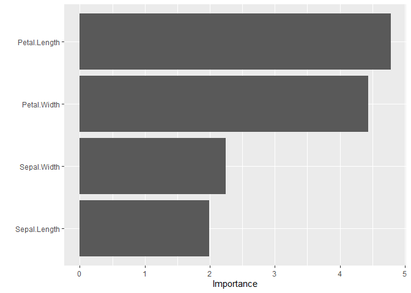
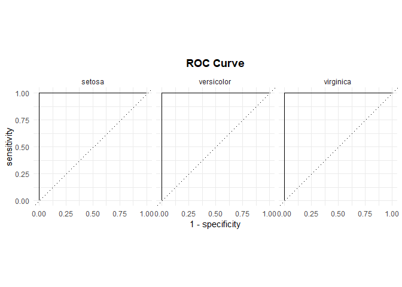

Tidymodel
================

# Tidymodel

tidymodels is a collection of R packages designed for machine learning
and statistical modeling using a tidyverse-compatible workflow. It helps
streamline the entire modeling process—from data splitting and
preprocessing to model tuning, evaluation, and deployment—using
consistent syntax and principles.

## Why use tidymodels?

- Unified syntax for different models (regression, classification, etc.)

- Tidy data principles (from the tidyverse)

- Reproducible workflows

- Model tuning and evaluation built-in

- Compatible with many ML engines (random forest, XGBoost, SVM, etc.)

## Core tidymodels Packages in Workflow Order

The `tidymodels` ecosystem is organized to follow a consistent modeling
process. Below is a list of the core packages used at each stage:

| Step | Package | Description |
|----|----|----|
| **1. Data Splitting** | `rsample` | For data splitting, cross-validation, bootstrapping, etc. |
| **2. Data Preprocessing** | `recipes` | For feature engineering, transformation, and normalization |
| **3. Model Specification** | `parsnip` | Unified interface to define and train models |
| **4. Workflow Assembly** | `workflows` | Combine recipe and model into a single object |
| **5. Model Tuning** | `tune` | Hyperparameter tuning with resampling |
| **6. Parameter Definitions** | `dials` | Provides parameter objects and ranges for tuning |
| **7. Model Evaluation** | `yardstick` | Metrics for model evaluation (accuracy, RMSE, etc.) |
| **8. Tidying Results** | `broom` | Convert model results to tidy format |
| **9. Statistical Inference** | `infer` | Perform tidy-style hypothesis testing and inference |

> Note: These packages are automatically installed with the `tidymodels`
> meta-package.

# Example for tidymodels

## package loading

``` r
library(tidymodels)
```

    ## Warning: package 'tidymodels' was built under R version 4.4.3

    ## ── Attaching packages ────────────────────────────────────── tidymodels 1.3.0 ──

    ## ✔ broom        1.0.8     ✔ recipes      1.3.1
    ## ✔ dials        1.4.0     ✔ rsample      1.3.0
    ## ✔ dplyr        1.1.4     ✔ tibble       3.2.1
    ## ✔ ggplot2      3.5.2     ✔ tidyr        1.3.1
    ## ✔ infer        1.0.8     ✔ tune         1.3.0
    ## ✔ modeldata    1.4.0     ✔ workflows    1.2.0
    ## ✔ parsnip      1.3.2     ✔ workflowsets 1.1.1
    ## ✔ purrr        1.0.4     ✔ yardstick    1.3.2

    ## Warning: package 'broom' was built under R version 4.4.3

    ## Warning: package 'dials' was built under R version 4.4.3

    ## Warning: package 'scales' was built under R version 4.4.3

    ## Warning: package 'ggplot2' was built under R version 4.4.3

    ## Warning: package 'infer' was built under R version 4.4.3

    ## Warning: package 'parsnip' was built under R version 4.4.3

    ## Warning: package 'purrr' was built under R version 4.4.3

    ## Warning: package 'recipes' was built under R version 4.4.3

    ## Warning: package 'rsample' was built under R version 4.4.3

    ## Warning: package 'tune' was built under R version 4.4.3

    ## Warning: package 'workflows' was built under R version 4.4.3

    ## Warning: package 'workflowsets' was built under R version 4.4.3

    ## Warning: package 'yardstick' was built under R version 4.4.3

    ## ── Conflicts ───────────────────────────────────────── tidymodels_conflicts() ──
    ## ✖ purrr::discard() masks scales::discard()
    ## ✖ dplyr::filter()  masks stats::filter()
    ## ✖ dplyr::lag()     masks stats::lag()
    ## ✖ recipes::step()  masks stats::step()

## Loading the data

``` r
iris=iris
```

## data Splitting

``` r
set.seed(123)
iris_split <- initial_split(iris, prop = 0.8)
iris_train <- training(iris_split)
iris_test  <- testing(iris_split)
```

The concept of data splitting is crucial in machine learning to ensure
that the model can generalize well to unseen data. The `initial_split()`
function from the `rsample` package allows us to split the dataset into
training and testing sets.

## Data Preprocessing

``` r
iris_recipe <- recipe(Species ~ ., data = iris_train) %>% 
  step_normalize(all_predictors()) 
```

The `recipe()` function from the `recipes` package is used to define a
preprocessing recipe. In this case, we are normalizing all predictor
variables to have a mean of 0 and a standard deviation of 1.

## Extracing the recipe

``` r
iris_recipe %>% 
  prep() %>% 
  juice() %>% head()
```

    ## # A tibble: 6 × 5
    ##   Sepal.Length Sepal.Width Petal.Length Petal.Width Species  
    ##          <dbl>       <dbl>        <dbl>       <dbl> <fct>    
    ## 1      -1.83        -0.135       -1.51       -1.46  setosa   
    ## 2      -1.00         0.548       -1.34       -1.33  setosa   
    ## 3       2.18         1.69         1.61        1.26  virginica
    ## 4      -1.71         0.321       -1.40       -1.33  setosa   
    ## 5       0.0570      -0.135        0.719       0.739 virginica
    ## 6       0.765       -0.135        0.775       0.997 virginica

The `prep()` function prepares the recipe for use, and the `juice()`
function extracts the preprocessed data. This allows us to see how the
data looks after applying the preprocessing steps defined in the recipe.
\> inside the prep() function, the recipe is applied to the training
data as a default behavior. If you want to apply for any data we can
specify the data argument inside the prep() function.

## Model Specification

``` r
boost_tree_xgboost_spec <-
  boost_tree(tree_depth = tune(), trees = tune(), learn_rate = tune(), min_n = tune(), loss_reduction = tune(), sample_size = tune(), stop_iter = tune()) |>
  set_engine('xgboost') |>
  set_mode('classification')

multinom_reg_glmnet_spec <-
  multinom_reg(penalty = tune(), mixture = tune()) |>
  set_engine('glmnet')

rand_forest_randomForest_spec <-
  rand_forest(mtry = tune(), min_n = tune()) |>
  set_engine('randomForest') |>
  set_mode('classification')
```

The `parsnip` package allows us to specify the model we want to use. In
this example, we define three different models: a boosted tree model
using XGBoost, a multinomial regression model using glmnet, and a random
forest model using randomForest. Each model has hyperparameters that we
will tune later.

also use `parsnip:::parsnip_addin()` to interactively select models and
their parameters.

## Cross-Validation

``` r
cv_folds <- vfold_cv(iris_train, v = 5)
```

Cross-validation is a technique to assess how the results of a
statistical analysis will generalize to an independent dataset. The
`vfold_cv()` function from the `rsample` package creates 5-fold
cross-validation folds for the training data.

## Defining Metrics

``` r
metrics <- metric_set(accuracy, kap, roc_auc)
```

The `yardstick` package provides functions to define metrics for model
evaluation. In this case, we are interested in accuracy, kappa, and ROC
AUC. \## Model Workflow

``` r
Model_workflow=workflow_set(
  preproc=list(rec=iris_recipe),
  model=list(boost_tree_xgboost=boost_tree_xgboost_spec,
             multinom_reg_glmnet=multinom_reg_glmnet_spec,
             rand_forest_randomForest=rand_forest_randomForest_spec)
)
```

The `workflow_set()` function from the `workflows` package allows us to
create a set of workflows that combine preprocessing recipes and model
specifications. This is useful for comparing different models and
preprocessing steps in a systematic way.

## Model Tuning

``` r
set.seed(123)
Model_tuned <- workflow_map(
  Model_workflow,
  resamples = cv_folds,
  grid = 10,
  metrics = metric_set(accuracy),
  verbose = TRUE
)
```

    ## i 1 of 3 tuning:     rec_boost_tree_xgboost

    ## Warning: package 'xgboost' was built under R version 4.4.3

    ## → A | warning: `early_stop` was reduced to 0.

    ## There were issues with some computations   A: x1There were issues with some computations   A: x2There were issues with some computations   A: x3There were issues with some computations   A: x4There were issues with some computations   A: x5There were issues with some computations   A: x5
    ## ✔ 1 of 3 tuning:     rec_boost_tree_xgboost (12.3s)
    ## i 2 of 3 tuning:     rec_multinom_reg_glmnet

    ## Warning: package 'glmnet' was built under R version 4.4.3

    ## Warning: package 'Matrix' was built under R version 4.4.3

    ## ✔ 2 of 3 tuning:     rec_multinom_reg_glmnet (2.9s)
    ## i 3 of 3 tuning:     rec_rand_forest_randomForest
    ## i Creating pre-processing data to finalize unknown parameter: mtry
    ## ✔ 3 of 3 tuning:     rec_rand_forest_randomForest (3s)

The `workflow_map()` function from the `workflows` package allows us to
apply the model tuning process across different models and
hyperparameter combinations. We specify the resampling method, the grid
size for hyperparameter tuning, and the metrics we want to evaluate.

``` r
Model_tuned %>% collect_metrics() %>%
  filter(.metric == "accuracy") %>%
  select(wflow_id, .metric, mean, std_err) %>%
  arrange(desc(mean))
```

    ## # A tibble: 30 × 4
    ##    wflow_id                     .metric   mean std_err
    ##    <chr>                        <chr>    <dbl>   <dbl>
    ##  1 rec_multinom_reg_glmnet      accuracy 0.983  0.0167
    ##  2 rec_multinom_reg_glmnet      accuracy 0.983  0.0167
    ##  3 rec_multinom_reg_glmnet      accuracy 0.983  0.0167
    ##  4 rec_multinom_reg_glmnet      accuracy 0.983  0.0167
    ##  5 rec_multinom_reg_glmnet      accuracy 0.983  0.0167
    ##  6 rec_multinom_reg_glmnet      accuracy 0.983  0.0167
    ##  7 rec_multinom_reg_glmnet      accuracy 0.967  0.0243
    ##  8 rec_multinom_reg_glmnet      accuracy 0.967  0.0243
    ##  9 rec_rand_forest_randomForest accuracy 0.958  0.0132
    ## 10 rec_rand_forest_randomForest accuracy 0.958  0.0228
    ## # ℹ 20 more rows

This code collects the metrics from the tuned models and filters for
accuracy. It then selects relevant columns and arranges the results in
descending order of mean accuracy.

``` r
Model_tuned$wflow_id
```

    ## [1] "rec_boost_tree_xgboost"       "rec_multinom_reg_glmnet"     
    ## [3] "rec_rand_forest_randomForest"

This line retrieves the workflow IDs of the tuned models, which can be
useful for further analysis or deployment.

## Extracting Specific Model

``` r
# For multinomial logistic regression
glmnet_result <- Model_tuned %>%
  extract_workflow_set_result("rec_multinom_reg_glmnet")
```

This code extracts the results of a specific model (in this case, the
multinomial logistic regression model) from the tuned models. The
`extract_workflow_set_result()` function allows us to access the results
of a particular workflow by its ID.

## Selecting the best model

``` r
best_params <- select_best(glmnet_result, metric = "accuracy")
```

The `select_best()` function from the `tune` package allows us to select
the best hyperparameters based on a specified metric (in this case,
accuracy). This is useful for identifying the optimal settings for our
model.

## Finalize workflow

``` r
final_workflow <- Model_tuned %>%
  extract_workflow("rec_multinom_reg_glmnet") %>%
  finalize_workflow(best_params)
```

The `finalize_workflow()` function is used to finalize the workflow with
the best hyperparameters. This prepares the model for training on the
entire training dataset.

## Fit the final model

``` r
final_workflow %>% last_fit(iris_split,
                            metrics = metric_set(accuracy, roc_auc, kap))
```

    ## # Resampling results
    ## # Manual resampling 
    ## # A tibble: 1 × 6
    ##   splits           id               .metrics .notes   .predictions .workflow 
    ##   <list>           <chr>            <list>   <list>   <list>       <list>    
    ## 1 <split [120/30]> train/test split <tibble> <tibble> <tibble>     <workflow>

The `last_fit()` function from the `workflows` package fits the
finalized workflow to the training data and evaluates it on the testing
data. We specify the metrics we want to calculate for model evaluation.

the last fit automatically splits the data into training and testing
sets, fits the model on the training set, and evaluates it on the
testing set. This is a convenient way to assess the model’s performance
without manually splitting the data again.

## Creating a model on training data Manually

``` r
final_model <- final_workflow %>%
  fit(data = iris_train)
```

The `fit()` function is used to train the finalized workflow on the
training data. This creates a model that can be used for predictions on
new data.

## Summary of the final model

``` r
fitted_model <- final_model %>% pull_workflow_fit()
```

    ## Warning: `pull_workflow_fit()` was deprecated in workflows 0.2.3.
    ## ℹ Please use `extract_fit_parsnip()` instead.
    ## This warning is displayed once every 8 hours.
    ## Call `lifecycle::last_lifecycle_warnings()` to see where this warning was
    ## generated.

``` r
# View model coefficients
fitted_model %>% tidy()
```

    ## # A tibble: 15 × 4
    ##    class      term         estimate   penalty
    ##    <chr>      <chr>           <dbl>     <dbl>
    ##  1 setosa     (Intercept)     0.259 0.0000359
    ##  2 setosa     Sepal.Length   -1.99  0.0000359
    ##  3 setosa     Sepal.Width     2.24  0.0000359
    ##  4 setosa     Petal.Length   -4.78  0.0000359
    ##  5 setosa     Petal.Width    -4.44  0.0000359
    ##  6 versicolor (Intercept)     5.20  0.0000359
    ##  7 versicolor Sepal.Length    1.90  0.0000359
    ##  8 versicolor Sepal.Width    -0.205 0.0000359
    ##  9 versicolor Petal.Length   -3.05  0.0000359
    ## 10 versicolor Petal.Width    -1.43  0.0000359
    ## 11 virginica  (Intercept)    -5.46  0.0000359
    ## 12 virginica  Sepal.Length    0     0.0000359
    ## 13 virginica  Sepal.Width    -1.85  0.0000359
    ## 14 virginica  Petal.Length    8.02  0.0000359
    ## 15 virginica  Petal.Width     6.05  0.0000359

``` r
# View model coefficients
fitted_model
```

    ## parsnip model object
    ## 
    ## 
    ## Call:  glmnet::glmnet(x = maybe_matrix(x), y = y, family = "multinomial",      alpha = ~0.155555555555556) 
    ## 
    ##     Df  %Dev  Lambda
    ## 1    0  0.00 2.80800
    ## 2    2  0.92 2.55800
    ## 3    2  2.30 2.33100
    ## 4    2  4.18 2.12400
    ## 5    3  6.34 1.93500
    ## 6    3  8.66 1.76300
    ## 7    4 11.06 1.60700
    ## 8    4 13.63 1.46400
    ## 9    4 16.14 1.33400
    ## 10   4 18.60 1.21500
    ## 11   4 21.13 1.10700
    ## 12   4 23.64 1.00900
    ## 13   4 26.08 0.91950
    ## 14   4 28.44 0.83780
    ## 15   4 30.72 0.76330
    ## 16   4 32.93 0.69550
    ## 17   4 35.06 0.63370
    ## 18   4 37.11 0.57740
    ## 19   4 39.08 0.52610
    ## 20   4 40.97 0.47940
    ## 21   4 42.79 0.43680
    ## 22   4 44.54 0.39800
    ## 23   4 46.22 0.36270
    ## 24   4 47.83 0.33040
    ## 25   4 49.38 0.30110
    ## 26   4 50.86 0.27430
    ## 27   4 52.29 0.25000
    ## 28   4 53.66 0.22780
    ## 29   4 54.99 0.20750
    ## 30   4 56.26 0.18910
    ## 31   4 57.49 0.17230
    ## 32   4 58.68 0.15700
    ## 33   4 59.84 0.14300
    ## 34   4 60.96 0.13030
    ## 35   4 62.05 0.11880
    ## 36   4 63.12 0.10820
    ## 37   4 64.16 0.09859
    ## 38   4 65.19 0.08983
    ## 39   4 66.22 0.08185
    ## 40   4 67.27 0.07458
    ## 41   4 68.30 0.06795
    ## 42   4 69.35 0.06192
    ## 43   4 70.39 0.05642
    ## 44   4 71.42 0.05140
    ## 45   4 72.43 0.04684
    ## 46   4 73.44 0.04268
    ## 47   4 74.42 0.03889
    ## 48   4 75.38 0.03543
    ## 49   4 76.32 0.03228
    ## 50   4 77.23 0.02942
    ## 51   4 78.11 0.02680
    ## 52   4 78.97 0.02442
    ## 53   4 79.79 0.02225
    ## 54   4 80.59 0.02028
    ## 55   4 81.36 0.01847
    ## 56   4 82.10 0.01683
    ## 57   4 82.82 0.01534
    ## 58   4 83.52 0.01397
    ## 59   4 84.18 0.01273
    ## 60   4 84.82 0.01160
    ## 61   4 85.43 0.01057
    ## 62   4 86.01 0.00963
    ## 63   4 86.57 0.00878
    ## 64   4 87.10 0.00800
    ## 65   4 87.61 0.00729
    ## 66   4 88.10 0.00664
    ## 67   4 88.57 0.00605
    ## 68   4 89.01 0.00551
    ## 69   4 89.43 0.00502
    ## 70   4 89.84 0.00458
    ## 71   4 90.22 0.00417
    ## 72   4 90.59 0.00380
    ## 73   4 90.94 0.00346
    ## 74   4 91.28 0.00315
    ## 75   4 91.60 0.00287
    ## 76   4 91.90 0.00262
    ## 77   4 92.19 0.00239
    ## 78   4 92.47 0.00217
    ## 79   4 92.73 0.00198
    ## 80   4 92.98 0.00180
    ## 81   4 93.22 0.00164
    ## 82   4 93.45 0.00150
    ## 83   4 93.67 0.00136
    ## 84   4 93.87 0.00124
    ## 85   4 94.07 0.00113
    ## 86   4 94.26 0.00103
    ## 87   4 94.44 0.00094
    ## 88   4 94.61 0.00086
    ## 89   4 94.78 0.00078
    ## 90   4 94.93 0.00071
    ## 91   4 95.08 0.00065
    ## 92   4 95.22 0.00059
    ## 93   4 95.36 0.00054
    ## 94   4 95.49 0.00049
    ## 95   4 95.62 0.00045
    ## 96   4 95.74 0.00041
    ## 97   4 95.85 0.00037
    ## 98   4 95.96 0.00034
    ## 99   4 96.06 0.00031
    ## 100  4 96.16 0.00028

## To know the variable importance

``` r
library(vip)
```

    ## Warning: package 'vip' was built under R version 4.4.3

    ## 
    ## Attaching package: 'vip'

    ## The following object is masked from 'package:utils':
    ## 
    ##     vi

``` r
final_workflow %>%
  fit(data = iris_train) %>% pull_workflow_fit() %>% vip(geom= "col")
```

<!-- -->

The `vip()` function from the `vip` package visualizes the variable
importance of the fitted model. This helps us understand which features
are most influential in making predictions. The `pull_workflow_fit()`
function extracts the fitted model from the workflow, allowing us to
visualize its variable importance.

## Model Evaluation

### Collect predictions

``` r
final_workflow %>% last_fit(iris_split,
                            metrics = metric_set(accuracy, roc_auc, kap)) %>% 
  collect_predictions()
```

    ## # A tibble: 30 × 8
    ##    .pred_class .pred_setosa .pred_versicolor .pred_virginica id     .row Species
    ##    <fct>              <dbl>            <dbl>           <dbl> <chr> <int> <fct>  
    ##  1 setosa             0.999        0.000678         2.83e-19 trai…     1 setosa 
    ##  2 setosa             0.996        0.00437          1.87e-17 trai…     2 setosa 
    ##  3 setosa             0.999        0.000522         8.89e-19 trai…     3 setosa 
    ##  4 setosa             0.999        0.000970         1.81e-19 trai…    11 setosa 
    ##  5 setosa             0.999        0.001000         1.10e-18 trai…    18 setosa 
    ##  6 setosa             0.996        0.00393          2.31e-18 trai…    19 setosa 
    ##  7 setosa             0.999        0.00118          7.30e-19 trai…    28 setosa 
    ##  8 setosa             1.000        0.0000283        7.01e-22 trai…    33 setosa 
    ##  9 setosa             0.998        0.00188          8.78e-19 trai…    36 setosa 
    ## 10 setosa             1.000        0.000364         1.44e-18 trai…    48 setosa 
    ## # ℹ 20 more rows
    ## # ℹ 1 more variable: .config <chr>

The `collect_predictions()` function collects the predictions made by
the model on the testing data. This allows us to analyze the model’s
performance and make further evaluations.

### Collect metrics

``` r
final_workflow %>% last_fit(iris_split,
                            metrics = metric_set(accuracy, roc_auc, kap)) %>% 
  collect_metrics()
```

    ## # A tibble: 3 × 4
    ##   .metric  .estimator .estimate .config             
    ##   <chr>    <chr>          <dbl> <chr>               
    ## 1 accuracy multiclass     0.967 Preprocessor1_Model1
    ## 2 kap      multiclass     0.946 Preprocessor1_Model1
    ## 3 roc_auc  hand_till      1     Preprocessor1_Model1

The `collect_metrics()` function collects the evaluation metrics
calculated during the last fit. This provides a summary of the model’s
performance on the testing data.

### Confusion Matrix

``` r
final_workflow %>% last_fit(iris_split,
                            metrics = metric_set(accuracy, roc_auc, kap)) %>% 
  collect_predictions() %>%
  conf_mat(truth = Species, estimate = .pred_class)
```

    ##             Truth
    ## Prediction   setosa versicolor virginica
    ##   setosa         10          0         0
    ##   versicolor      0         14         0
    ##   virginica       0          1         5

The `conf_mat()` function from the `yardstick` package creates a
confusion matrix to visualize the model’s performance in terms of true
positives, false positives, true negatives, and false negatives. This is
useful for understanding how well the model classifies different species
in the iris dataset.

#### Autoplot for confusion matrix

``` r
final_workflow %>% last_fit(iris_split,
                            metrics = metric_set(accuracy, roc_auc, kap)) %>% 
  collect_predictions() %>% conf_mat(truth = Species, estimate = .pred_class) %>% autoplot(type = "heatmap") +
  labs(title = "Confusion Matrix Heatmap",
       x = "Actual Species",
       y = "Predicted Species")+
  scale_fill_gradient(low = "white", high = "steelblue") +
  theme_minimal() +
  theme(plot.title = element_text(hjust=0.5,face="bold"))
```

    ## Scale for fill is already present.
    ## Adding another scale for fill, which will replace the existing scale.

<!-- --> The
`autoplot()` function from the `ggplot2` package allows us to create a
heatmap of the confusion matrix. This visualization helps to quickly
identify how well the model is performing across different classes.

### ROC Curve

``` r
final_workflow %>% last_fit(iris_split,
                            metrics = metric_set(accuracy, roc_auc, kap)) %>% 
  collect_predictions()  %>% 
  roc_curve(truth = Species, 
                                      .pred_setosa, .pred_versicolor, .pred_virginica,
                                      estimator = "hand_till")
```

    ## # A tibble: 96 × 4
    ##    .level  .threshold specificity sensitivity
    ##    <chr>        <dbl>       <dbl>       <dbl>
    ##  1 setosa -Inf             0                1
    ##  2 setosa    6.30e-12      0                1
    ##  3 setosa    2.17e-11      0.0500           1
    ##  4 setosa    4.91e-11      0.1              1
    ##  5 setosa    8.01e-10      0.15             1
    ##  6 setosa    3.98e- 9      0.2              1
    ##  7 setosa    4.20e- 6      0.25             1
    ##  8 setosa    4.23e- 6      0.3              1
    ##  9 setosa    1.36e- 5      0.35             1
    ## 10 setosa    3.34e- 5      0.4              1
    ## # ℹ 86 more rows

The `roc_curve()` function from the `yardstick` package creates a
Receiver Operating Characteristic (ROC) curve to visualize the model’s
performance in terms of true positive rate versus false positive rate.
This is particularly useful for binary classification problems, but can
also be adapted for multi-class problems.

#### Autoplot for ROC Curve

``` r
final_workflow %>% last_fit(iris_split,
                            metrics = metric_set(accuracy, roc_auc, kap)) %>% 
  collect_predictions()  %>% 
  roc_curve(truth = Species, 
            .pred_setosa, .pred_versicolor, .pred_virginica,
            estimator = "hand_till") %>% autoplot()+
  labs(title = "ROC Curve")+
  theme_minimal() +
  theme(plot.title = element_text(hjust=0.5,face="bold"))
```

<!-- -->

The `autoplot()` function is used to create a visually appealing ROC
curve. This plot helps to assess the trade-off between sensitivity and
specificity for different classification thresholds.

## Binding Columns

``` r
# 5. Predict and evaluate
final_preds <- predict(final_model, iris_test) %>%
  bind_cols(iris_test)
```

The `predict()` function is used to make predictions on the testing data
using the trained model. The `bind_cols()` function from the `dplyr`
package is then used to combine the predictions with the original
testing data, allowing for easy comparison and evaluation.

## predicting the value by manual entry

``` r
iris[4,]
```

    ##   Sepal.Length Sepal.Width Petal.Length Petal.Width Species
    ## 4          4.6         3.1          1.5         0.2  setosa

``` r
new_id=tribble(~Sepal.Length,~Sepal.Width,~Petal.Length,~Petal.Width,
              4.6,3.1,1.5,0.2 )
new_id
```

    ## # A tibble: 1 × 4
    ##   Sepal.Length Sepal.Width Petal.Length Petal.Width
    ##          <dbl>       <dbl>        <dbl>       <dbl>
    ## 1          4.6         3.1          1.5         0.2

``` r
predict(final_model,new_data=new_id,type="prob")
```

    ## # A tibble: 1 × 3
    ##   .pred_setosa .pred_versicolor .pred_virginica
    ##          <dbl>            <dbl>           <dbl>
    ## 1        0.999         0.000699        7.45e-18

`prob` is used to get the probability of that class will be present for
this data

``` r
predict(final_model,new_data=new_id,type="class")
```

    ## # A tibble: 1 × 1
    ##   .pred_class
    ##   <fct>      
    ## 1 setosa

`class` is used for getting the highest probability of the class will
present for this data

### To Save the model

``` r
library(readr)
```

    ## 
    ## Attaching package: 'readr'

    ## The following object is masked from 'package:yardstick':
    ## 
    ##     spec

    ## The following object is masked from 'package:scales':
    ## 
    ##     col_factor

``` r
write_rds(final_model,"iris_best_classification_model.rds")
best_model=read_rds("iris_best_classification_model.rds")
```

## Conclusion

The `tidymodels` framework provides a comprehensive and consistent
approach to machine learning in R. By following the tidyverse
principles, it allows for reproducible and efficient workflows that can
be easily adapted to various modeling tasks. The integration of multiple
packages within the `tidymodels` ecosystem simplifies the process of
data preparation, model training, evaluation, and deployment.

## Additional Resources

- [Tidymodels Official Documentation](https://www.tidymodels.org/)
