Practical sums
================

# Measure of Central Tendency For Discrete Data

``` r
##UNCTION FOR CALCULATING CENTRAL TENDENCY 

Central_Tendency_Discreate_case=function(x,f){
  # data 
  data=rep(x,f)
  #MEAN 
  MEAN=round(mean(data),3)
  # MEADIAN 
  MEDIAN=round(median(data),3)
  # MODE
  MODE=names(table(data))[table(data)==max(table(data))]|>as.numeric()
  # Result
  Value=c("Mean"=MEAN,"Median"=MEDIAN,"Mode"=MODE)
  return(cbind(Value))
}
x=c(0,1,2,3)
f=c(8,11,5,1)
Central_Tendency_Discreate_case(x,f)
```

    ##        Value
    ## Mean    0.96
    ## Median  1.00
    ## Mode    1.00

# Measure of Central Tendency for Continuous Data

``` r
# Central tendency code
central_tendency=function(l,u,f){
  #mean 
  m=(l+u)/2
  data1=rep(m,f)
  mean=mean(data1)
  #median
  c=cumsum(f)
  n=sum(f)
  prop=n/2
  medianclass=min(which(c>=prop))
  freq=f[medianclass]
  cf=c[medianclass-1]
  median_l=l[medianclass]
  median=median_l+((prop-cf)/freq)*(l[2]-l[1])
  #mode 
  modeclass=which(f==max(f))
  mode_l=l[modeclass]
  f0=f[modeclass-1]
  f1=f[modeclass]
  f2=f[modeclass+1]
  mode=mode_l+((f1-f0)/(2*f1-f0-f2))*(l[2]-l[1])
  #result
  Value=c("mean"=round(mean,4),"median"=round(median,4),"mode"=round(mode,4))
  return(cbind(Value))
}
# Data for Calculating Central tendency 
lo=c(145,150,155,160,165,170,175,180)
up=c(150,155,160,165,170,175,180,185)
fr=c(4,6,28,58,64,30,5,5)
# Function calling area 
central_tendency(lo,up,fr)
```

    ##           Value
    ## mean   165.1750
    ## median 165.3125
    ## mode   165.7500

# Measure of Dispersion

``` r
# Measure of Dispersion
measure_of_dispersion=function(x,f){
  data=rep(x,f)
  range=max(data)-min(data)
  variance=var(data)*(length(data)-1)/(length(data))
  standard_deviation=variance**(1/2)
  c.v=standard_deviation/mean(data)
  Values=c('Range'=round(range,4),'variance'=round(variance,4),
           'Standard Deviation'=round(standard_deviation,4),
           'Coefficient of Variation'=round(c.v,4))
  return(cbind(Values))
}
# Data for Calculating Dispersion
x=c(94.5,104.5,114.5,124.5,134.5,144.5,154.5,164.5,174.5)
f=c(5,8,22,27,17,9,5,5,2)
measure_of_dispersion(x,f)
```

    ##                            Values
    ## Range                     80.0000
    ## variance                 319.7100
    ## Standard Deviation        17.8804
    ## Coefficient of Variation   0.1406

# Histogram and Frequency Polygon

``` r
midx=seq(25,85,10)
frequency=c(10,24,18,12,8,5,3)
brk=seq(20,90,10)
# Data creating #######
data=rep(midx,frequency)
# Histrogram #####
par(mfrow=c(1,2))
hist(data,breaks = brk,xlab = "pocket money",
     ylab = "no of student",col = "gray",main = "Histogram")
# Line plot #####
plot(midx,frequency,type="o",lwd=2,xlab="pocket money",ylab = "no of student",
     col = "black",main = "Line diagram")
```

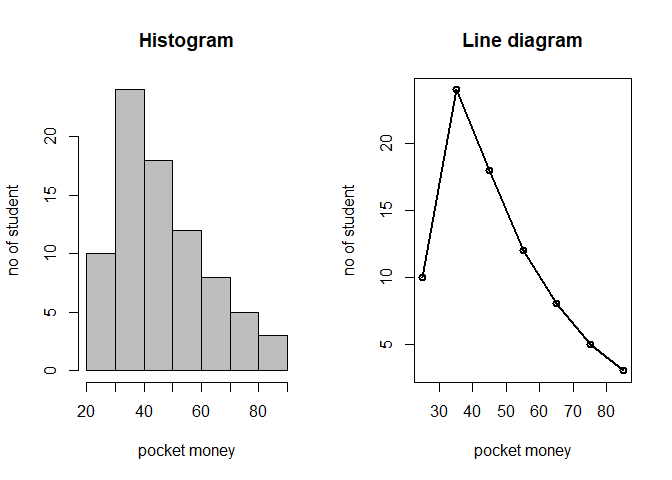<!-- -->

# Subdivided Bar Chart \[stacked and Grouped Bar chart\]

``` r
# Data
Music = c(3,3,2,1,2)
Drawing = c(4,2,3,5,1)
# Stacked Bar Chart
barplot(rbind(Music,Drawing),beside=TRUE,legend = c("Music","Drawing"),
        main = "Grouped Bar Chart",
        xlab = "Students interested in Music and Drawing",ylab = "No of student")
```

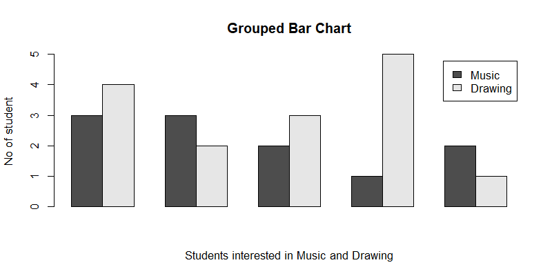

``` r
# Grouped Bar Chart
barplot(rbind(Music,Drawing),beside=FALSE,legend = c("Music","Drawing"),
        main = "Stacked Bar Chart",
        xlab = "Students interested in Music and Drawing",ylab = "No of student")
```

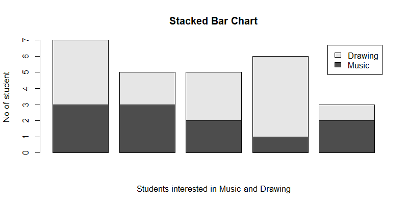

# OGIVE Curve

``` r
ll=seq(499.5,1099.5,100)
ul=seq(599.5,1199.5,100)
f=c(0,85,77,124,78,36,0)
af=cumsum(f)# ascending order cumsum
df=rev(cumsum(rev(f))) # decending order cumsum
#plot the diagram 
plot(ul,af,type="l",col="blue",xlab = "life of bulbs",
     ylab = "cummulative frequency",
     main="OGive curve",xlim=c(499.5,1199.5),lwd=2)
lines(ll,df,col="red",type="l",lwd=2)
```

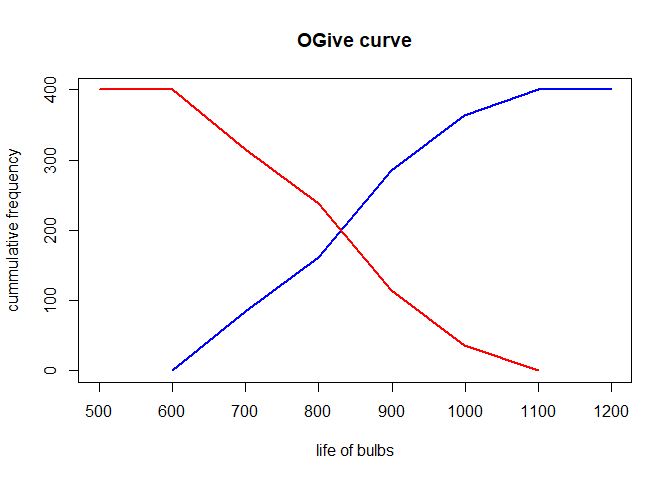<!-- -->

# Binomial Distribution

``` r
x=0:10
n=max(x)
f=c(6,20,28,12,8,6,0,0,0,0,0)
N=sum(f)
smean=sum(f*x)/N
p=smean/n
px=round(dbinom(x,n,p),4)
ef=px*N
plot(f,ef,type="p",xlab = "Observed frequency",
     ylab="Expected frequency",main="Binomial distribution",pch=16)
```

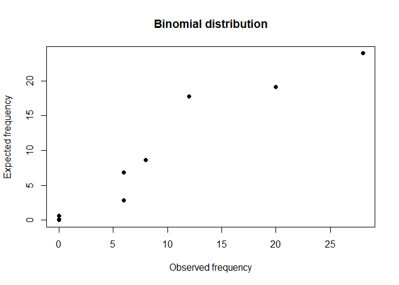<!-- -->

# Poisson Distribution

``` r
#sum 1
x1=0:3
l1=0.2
p1=1-sum(dpois(x1,l1))
p1
```

    ## [1] 5.684024e-05

``` r
# sum 2
x2= 0:8
l2=2.5
p2=1-sum(dpois(x2,l2))
p2
```

    ## [1] 0.001140253

``` r
#sum 3
x3=0:12
l3=0.5
p3=1-sum(dpois(x3,l3))
p3
```

    ## [1] 1.221245e-14

# Normal Distribution

``` r
# a generate a 20 random sample which follows normal distribution N(5,2)
set.seed(123) # to generate the same sample every time
x=rnorm(20,5,2)|>round(4)
Mean=mean(x)
Median=median(x)
standard_deviation=sd(x)
value=c("Mean"=Mean,"Median"=Median,"Standard Deviation"=standard_deviation)
cbind(value)
```

    ##                       value
    ## Mean               5.283240
    ## Median             5.240000
    ## Standard Deviation 1.945322

``` r
##for probability of normal distribution N(0,1)
pnorm(2) # P(X<=2)
```

    ## [1] 0.9772499

``` r
1-pnorm(2) # P(X>2)
```

    ## [1] 0.02275013

``` r
pnorm(2.5)-pnorm(0.84) # P(0.84<=X<=2.5)
```

    ## [1] 0.1942445

# Correlation

``` r
x=c(186,189,190,192,193,198,201,203,205)
y=c(85,86,86,90,87,91,93,103,101)
datam=data.frame(x,y)
cor(datam)
```

    ##           x         y
    ## x 1.0000000 0.9176368
    ## y 0.9176368 1.0000000

# Regression

``` r
x=c(10,43,76,78,55,48,93)
y=c(70,56,46,79,49,58,63)
datam=data.frame(x,y)
new_data=data.frame(x=c(100))
model=lm(y~x,data=datam)
model
```

    ## 
    ## Call:
    ## lm(formula = y ~ x, data = datam)
    ## 
    ## Coefficients:
    ## (Intercept)            x  
    ##    61.81978     -0.02913

``` r
predict(model,new_data)
```

    ##        1 
    ## 58.90701

# Checking Normality

``` r
set.seed(123)
x=rnorm(100,1,1)
par(mfrow=c(1,2))
boxplot(x,main="Boxplot for Checking Normality",col="gray",lwd=2)
qqnorm(x,main="QQ plot for Checking Normality",lwd=2,xlab="",ylab="")
qqline(x,lwd=2)
```

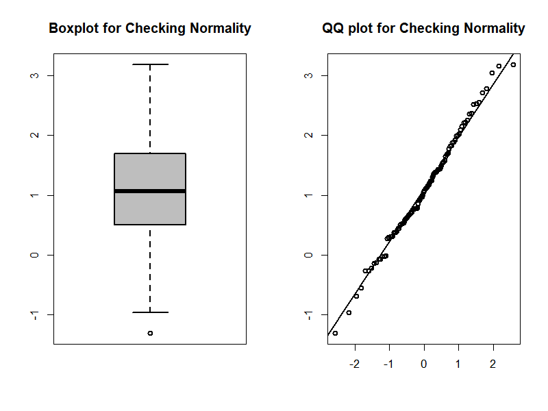

# T test for single mean

``` r
x=c(70,120,110,101,88,83,95,98,107,100)
t.test(x,mu=100)
```

    ## 
    ##  One Sample t-test
    ## 
    ## data:  x
    ## t = -0.62034, df = 9, p-value = 0.5504
    ## alternative hypothesis: true mean is not equal to 100
    ## 95 percent confidence interval:
    ##   86.98934 107.41066
    ## sample estimates:
    ## mean of x 
    ##      97.2

# Paired T Test

``` r
x=c(12.9,13.5,12.8,15.6,17.2,19.2,12.6,15.8,14.4,11.3)
y=c(12.7,13.6,12,15.2,16.8,20,12,15.9,16,11)
t.test(x,y,paired=TRUE)
```

    ## 
    ##  Paired t-test
    ## 
    ## data:  x and y
    ## t = 0.043905, df = 9, p-value = 0.9659
    ## alternative hypothesis: true mean difference is not equal to 0
    ## 95 percent confidence interval:
    ##  -0.5052446  0.5252446
    ## sample estimates:
    ## mean difference 
    ##            0.01

# Independent Sample T Test

``` r
x=c(1.2,0.8,1.1,0.7,0.9,1.1,1.5,0.8,1.8,0.9)
y=c(1.7,1.5,2,2.1,1.1,0.9,2.2,1.8,1.3,1.5)
t.test(x,y)
```

    ## 
    ##  Welch Two Sample t-test
    ## 
    ## data:  x and y
    ## t = -3.0348, df = 17.197, p-value = 0.007405
    ## alternative hypothesis: true difference in means is not equal to 0
    ## 95 percent confidence interval:
    ##  -0.8981415 -0.1618585
    ## sample estimates:
    ## mean of x mean of y 
    ##      1.08      1.61

# F Test

``` r
A=c(25,32,30,34,24,14,32,24,30,24,30,31,35,25)
B=c(44,34,22,10,47,31,40,30,32,35,13,21,35,29,22)
var.test(A,B,ratio=1,alternative="two.sided",conf.level=0.95)
```

    ## 
    ##  F test to compare two variances
    ## 
    ## data:  A and B
    ## F = 0.27712, num df = 13, denom df = 14, p-value = 0.02651
    ## alternative hypothesis: true ratio of variances is not equal to 1
    ## 95 percent confidence interval:
    ##  0.09200894 0.85404706
    ## sample estimates:
    ## ratio of variances 
    ##          0.2771212

# Chi square for Goodness of Fit

``` r
Freq=c(1026,1107,997,966,1075,933,1107,972,964,853)
chisq.test(Freq)
```

    ## 
    ##  Chi-squared test for given probabilities
    ## 
    ## data:  Freq
    ## X-squared = 58.542, df = 9, p-value = 2.558e-09

# Chi square for Independence

``` r
sample=matrix(data=c(200,250,150,300,50,50),
              ncol=3,nrow=2,byrow=FALSE)
rownames(sample)=c("Male","Female")
colnames(sample)=c("replication","Democrant","Independent")
chisq.test(sample)
```

    ## 
    ##  Pearson's Chi-squared test
    ## 
    ## data:  sample
    ## X-squared = 16.204, df = 2, p-value = 0.000303

# ONE WAY ANOVA

``` r
drug=rep(c("A","B","C"),each=9)
pair=c(4,5,4,3,2,4,8,4,6,6,8,4,5,4,6,5,8,6,6,7,6,6,7,5,6,5,5)
migraine=data.frame(drug,pair)
result=aov(pair~drug,data=migraine)
summary(result)
```

    ##             Df Sum Sq Mean Sq F value Pr(>F)  
    ## drug         2  11.63   5.815    2.99 0.0692 .
    ## Residuals   24  46.67   1.944                 
    ## ---
    ## Signif. codes:  0 '***' 0.001 '**' 0.01 '*' 0.05 '.' 0.1 ' ' 1

# TWO WAY ANOVA

``` r
water=rep(c("Cold water","warm water","hot water"),each=3)
type=rep(c("detA","detB","detC"),times=3)
value=c(45,43,55,37,40,56,42,44,46)
waterdata=data.frame(water,type,value)
result=aov(value~water+type,data=waterdata)
summary(result)
```

    ##             Df Sum Sq Mean Sq F value Pr(>F)  
    ## water        2  24.67   12.33   0.638 0.5748  
    ## type         2 222.00  111.00   5.741 0.0667 .
    ## Residuals    4  77.33   19.33                 
    ## ---
    ## Signif. codes:  0 '***' 0.001 '**' 0.01 '*' 0.05 '.' 0.1 ' ' 1

# Xbar and R Chart

``` r
library(qcc)
x1=c(5.8,6.4,5.8,5.7,6.5,5.2,5.1,5.8,4.9,6.4)
x2=c(6.2,6.9,5.2,6.4,5.7,5.2,6,6.2,5.7,6.3)
x3=c(6,5.3,5.5,5,6.7,5.8,5.6,6.2,5.6,4.4)
data=c(x1,x2,x3)
sample=rep(1:length(x1),times=3)
qcc.data=qcc.groups(data,sample)
invisible(qcc(qcc.data, type="xbar", std.dev="UWAVE-SD"))
```

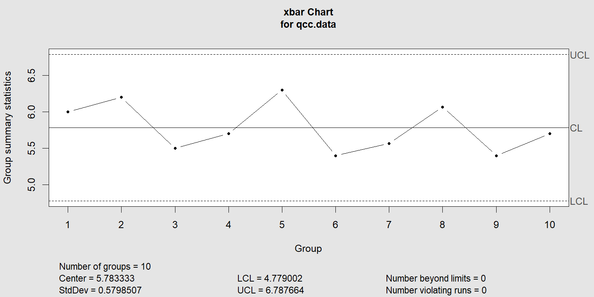

``` r
invisible(qcc(qcc.data, type="R")) 
```

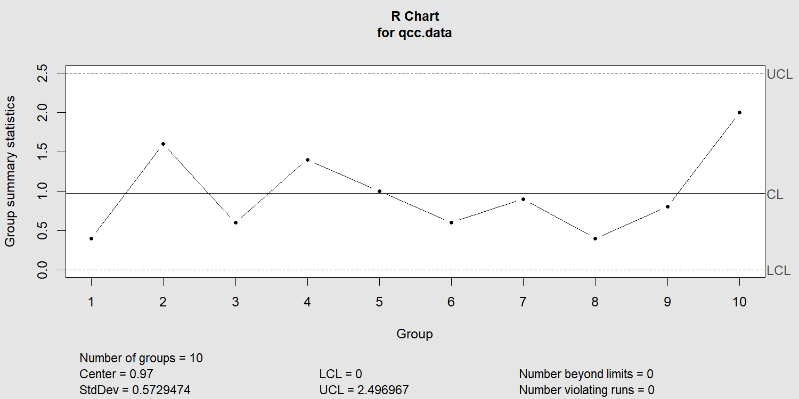

# Xbar and S Chart

``` r
library(qcc)
x1 <- c(27,30,21,40,51,33,30,35,20,22)
x2 <- c(23,17,44,21,34,30,22,48,34,50)
x3 <- c(36,27,22,29,17,28,18,20,15,45)
x4 <- c(34,32,28,24,10,22,12,47,42,41)
data <- c(x1, x2, x3, x4)
sample <- rep(1:length(x1), times=4)
qcc.data <- qcc.groups(data, sample)
# X-bar chart
invisible(qcc(qcc.data, type="xbar", std.dev="UWAVE-SD"))
```

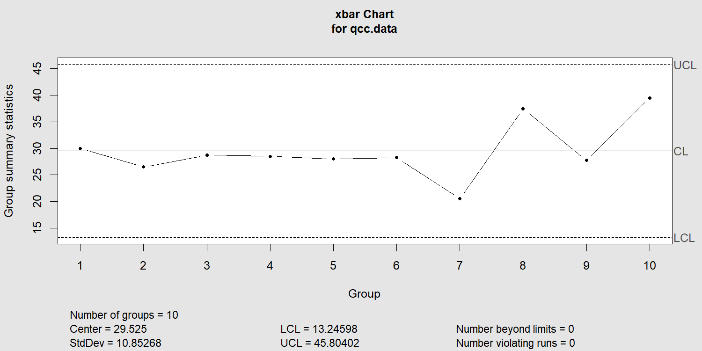

``` r
# S chart
invisible(qcc(qcc.data, type="S"))
```

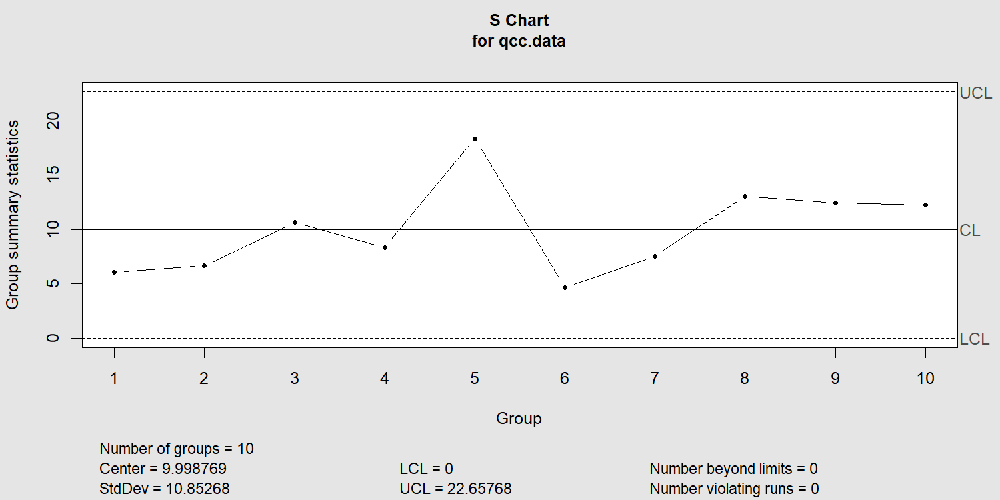

# P Chart

``` r
# Load the qcc package
library(qcc)
# Data: 
defectives <- c(22,40,36,42,40,30,34,32,39,70,80,44,30,32,44,
                20,46,28,30,36,46,50,46,32,42,46,30,38,30,24)
# Sample size (assume each sample contains 50 items)
sample_size <- rep(1000, length(defectives))
# Create a p-chart
invisible(qcc(defectives, sizes = sample_size, type = "p"))
```

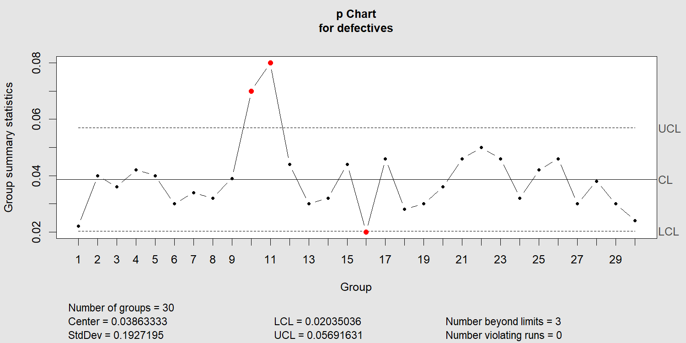

# NP Chart

``` r
k1=c(0,5,3,7,5,5,4,9,0,5,3,7,5,5,4,8)
sample_size1 <- rep(100, length(k1))
# Create an np-chart
invisible(qcc(k1, sizes = sample_size1, type = "np"))
```

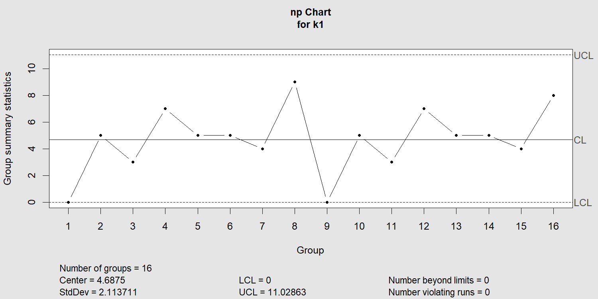

# C Chart

``` r
defect=c(2,0,4,1,0,8,0,1,2,0,6,1,2,1,0,3,2,1,0,2)
invisible(qcc(defect, type="c"))
```

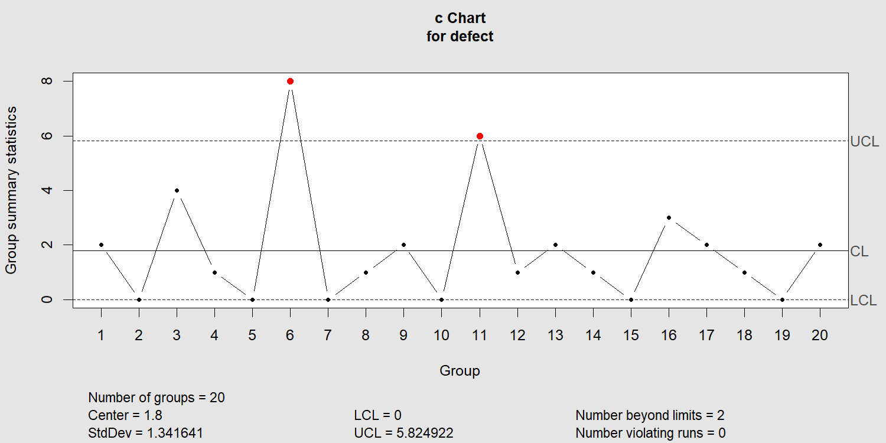

# U Chart

``` r
c=c(5,7,3,15,4,6,10,1,16,2)
k=c(200,80,100,300,120,90,250,50,100,70)
data=data.frame(c,k)
s=c(1:length(c))
u=c/k
ubar=sum(u)/length(u)
lcl=ubar-3*sqrt(ubar/length(u))
ucl=ubar+3*sqrt(ubar/length(u))
cl=ubar
plot(u,ylim=c(min(u)-0.5,max(u)+0.5),xlim=c(1,length(u)),
     pch=19,xlab="Sample No",ylab="Proportion of defectives",
     main="U chart")
abline(h=cl,lty="dashed")
abline(h=lcl,lty="dashed")
abline(h=ucl,lty="dashed")
cl_lab=paste("CL=",round(cl,2),sep="")
ucl_lab=paste("UCL=",round(ucl,2),sep="")
lcl_lab=paste("LCL=",round(lcl,2),sep="")
text(5,cl+0.01,cl_lab)
text(5,ucl+0.01,ucl_lab)
text(5,lcl+0.01,lcl_lab)
```

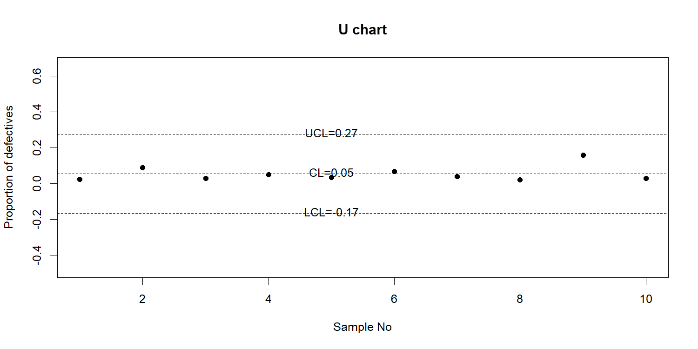

# Logistic regression

``` r
data=mtcars[,c("am","cyl","hp","wt")]
model=glm(am~cyl+hp+wt,data=data,family=binomial)
summary(model)
```

    ## 
    ## Call:
    ## glm(formula = am ~ cyl + hp + wt, family = binomial, data = data)
    ## 
    ## Coefficients:
    ##             Estimate Std. Error z value Pr(>|z|)  
    ## (Intercept) 19.70288    8.11637   2.428   0.0152 *
    ## cyl          0.48760    1.07162   0.455   0.6491  
    ## hp           0.03259    0.01886   1.728   0.0840 .
    ## wt          -9.14947    4.15332  -2.203   0.0276 *
    ## ---
    ## Signif. codes:  0 '***' 0.001 '**' 0.01 '*' 0.05 '.' 0.1 ' ' 1
    ## 
    ## (Dispersion parameter for binomial family taken to be 1)
    ## 
    ##     Null deviance: 43.2297  on 31  degrees of freedom
    ## Residual deviance:  9.8415  on 28  degrees of freedom
    ## AIC: 17.841
    ## 
    ## Number of Fisher Scoring iterations: 8

# Measure of Dispersion Continuous case

``` r
measure_of_dispersion=function(x,f){
  data=rep(x,f)
  range=max(data)-min(data)
  variance=var(data)*(length(data)-1)/(length(data))
  standard_deviation=variance**(1/2)
  c.v=standard_deviation/mean(data)
  Values=c('Range'=round(range,4),'variance'=round(variance,4),
           'Standard Deviation'=round(standard_deviation,4),
           'Coefficient of Variation'=round(c.v,4))
  return(cbind(Values))
}
x=c(94.5,104.5,114.5,124.5,134.5,144.5,154.5,164.5,174.5)
f=c(5,8,22,27,17,9,5,5,2)
measure_of_dispersion(x,f)
```

    ##                            Values
    ## Range                     80.0000
    ## variance                 319.7100
    ## Standard Deviation        17.8804
    ## Coefficient of Variation   0.1406
