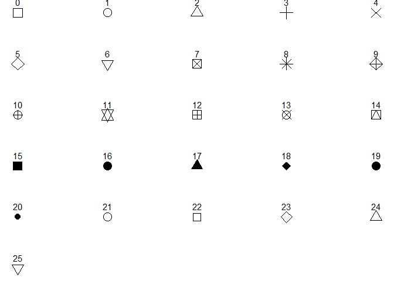

## ggplot2 Point Shapes

| Shape | Description              |
|------:|--------------------------|
|     0 | Square (open)            |
|     1 | Circle (open)            |
|     2 | Triangle (open)          |
|     3 | Plus                     |
|     4 | Cross                    |
|     5 | Diamond (open)           |
|     6 | Triangle down (open)     |
|     7 | Square cross             |
|     8 | Star                     |
|     9 | Diamond plus             |
|    10 | Circle plus              |
|    11 | Triangle up/down         |
|    12 | Square plus              |
|    13 | Circle cross             |
|    14 | Square triangle          |
|    15 | Square (filled)          |
|    16 | Circle (filled)          |
|    17 | Triangle (filled)        |
|    18 | Diamond (filled)         |
|    19 | Large circle (filled)    |
|    20 | Bullet                   |
|    21 | Circle (fillable)        |
|    22 | Square (fillable)        |
|    23 | Diamond (fillable)       |
|    24 | Triangle up (fillable)   |
|    25 | Triangle down (fillable) |

## Example

<!-- -->
